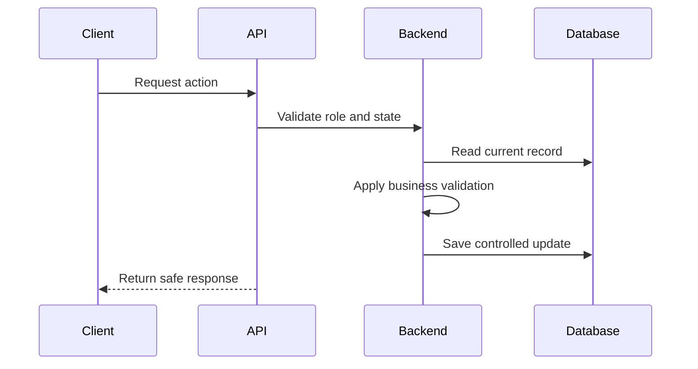

# Jeerah API

> Public API design overview for **Jeerah**, a commercial smart trip-pooling delivery platform.

---

## Repository Notice

This document does not publish production API endpoints.

It does not include request payloads, response payloads, backend function names, authentication secrets, Supabase Edge Functions, payment webhooks, internal routes, deployment URLs, or private business rules.

This document explains the API design approach at a high level only.

---

## API Overview

Jeerah uses backend-controlled workflows to coordinate customer, driver, admin, order, trip, invoice, and payment actions.

The API layer should act as a trusted boundary between clients and backend state.

---

## API Design Goals

| Goal | Description |
|---|---|
| Secure actions | Critical workflows are validated server-side |
| Role-aware access | Customers, drivers, and admins have different abilities |
| State validation | Actions depend on current order/trip state |
| Minimal exposure | Clients receive only the data they need |
| Consistency | Related state changes are coordinated |
| Future scalability | API patterns can support future modules |

---

## Public API Categories

| Category | Example Responsibility |
|---|---|
| Authentication | Validate user context |
| Customer Orders | Create and track orders |
| Driver Trips | Accept and execute trips |
| Invoice Workflow | Submit invoice details |
| Payment Workflow | Handle payment method selection |
| Delivery Workflow | Pickup and delivery progression |
| Admin Operations | Monitor and manage operations |
| Notifications | Trigger or receive event updates |

---

## API Workflow Pattern



---

## API Security Principles

- Do not expose service-role credentials.
- Do not trust client-side calculations.
- Validate role and ownership.
- Validate current lifecycle state.
- Avoid returning unnecessary fields.
- Keep payment handling private.
- Keep trip-pooling logic private.
- Keep admin routes protected.

---

## Public Example: Workflow Action

This is a conceptual example only, not a real endpoint:

```text
POST /workflow/action
```

Conceptual request:

```json
{
  "actor": "driver",
  "action": "submit_invoice",
  "entity": "order",
  "data": "sanitized_public_example"
}
```

Conceptual response:

```json
{
  "status": "accepted",
  "next_state": "payment_required"
}
```

This example is intentionally generic and does not represent the production API.

---

## What Is Not Included

This repository does not include:

- Real endpoints
- Real payloads
- Edge Function names
- API keys
- Service-role keys
- Payment webhooks
- Internal validation rules
- Database queries
- Production URLs
- Error codes
- Admin routes

---

## Future API Improvements

- Versioning strategy
- API documentation for internal team
- Better error taxonomy
- Rate limiting
- Admin audit endpoints
- Notification events
- Payment reconciliation hooks
- Analytics endpoints
- Internal API testing suite

---

## Summary

Jeerah's API layer is designed as a secure workflow boundary, not a simple public CRUD interface.

The public repository describes the API philosophy without revealing real implementation.

---

<div align="center">

**Jeerah API**

*Workflow-first. Secure by design. Private implementation.*

</div>
