# Jeerah Architecture

> Public high-level architecture documentation for **Jeerah**, a smart trip-pooling delivery platform for remote communities.

---

## Repository Notice

This document is part of the public showcase repository for Jeerah.

It explains the architecture at a high level only. It does **not** include production source code, private database schema, Supabase configuration, Row Level Security policies, Edge Function implementation, payment logic, trip-pooling algorithm, pricing logic, deployment secrets, or any proprietary business rules.

Jeerah is a commercial product under active development. This document is intended for portfolio, interview, and product showcase purposes.

---

## Table of Contents

- [Architecture Overview](#architecture-overview)
- [Architectural Goals](#architectural-goals)
- [High-Level System Diagram](#high-level-system-diagram)
- [Architecture Style](#architecture-style)
- [Core System Layers](#core-system-layers)
- [Client Layer](#client-layer)
- [Backend Layer](#backend-layer)
- [Data Layer](#data-layer)
- [Authentication Layer](#authentication-layer)
- [Realtime Layer](#realtime-layer)
- [Storage Layer](#storage-layer)
- [Admin Layer](#admin-layer)
- [Order Lifecycle Architecture](#order-lifecycle-architecture)
- [Trip Lifecycle Architecture](#trip-lifecycle-architecture)
- [Payment Workflow Architecture](#payment-workflow-architecture)
- [Invoice Workflow Architecture](#invoice-workflow-architecture)
- [Security Architecture](#security-architecture)
- [Scalability Architecture](#scalability-architecture)
- [Reliability Considerations](#reliability-considerations)
- [Observability Considerations](#observability-considerations)
- [Data Flow Examples](#data-flow-examples)
- [Public vs Private Architecture](#public-vs-private-architecture)
- [Architecture Decisions](#architecture-decisions)
- [Future Architecture Improvements](#future-architecture-improvements)
- [Related Documents](#related-documents)

---

## Architecture Overview

Jeerah follows a **cloud-backed mobile architecture** designed around three main product surfaces:

1. **Customer Mobile Application**
2. **Driver Mobile Application**
3. **Admin Dashboard**

These surfaces communicate with a backend powered by Supabase, PostgreSQL, authentication services, server-side workflows, and realtime update capabilities.

The architecture is designed to support a delivery business where each order and trip moves through a controlled lifecycle.

At a high level, Jeerah architecture can be described as:

```text
Mobile Apps
   ↓
Authentication
   ↓
Backend Workflows
   ↓
Database State
   ↓
Realtime Updates
   ↓
Operational Monitoring
```

The system is state-driven. This means the platform depends heavily on clear order statuses, trip statuses, role-aware access, and secure backend-controlled transitions.

---

## Architectural Goals

Jeerah's architecture is built around the following goals:

| Goal | Description |
|---|---|
| Mobile-first | Support customers and drivers primarily through mobile applications |
| Secure by design | Keep sensitive operations protected behind backend workflows |
| State-driven | Model orders and trips as structured lifecycle entities |
| Commercially protected | Keep proprietary logic private and away from the public client |
| Scalable | Support growth across regions, drivers, customers, and order volume |
| Maintainable | Allow iterative development without breaking the core workflow |
| Observable | Support future monitoring, analytics, and operational visibility |
| Extensible | Allow future features such as notifications, analytics, merchant tools, and advanced routing |

---

## High-Level System Diagram

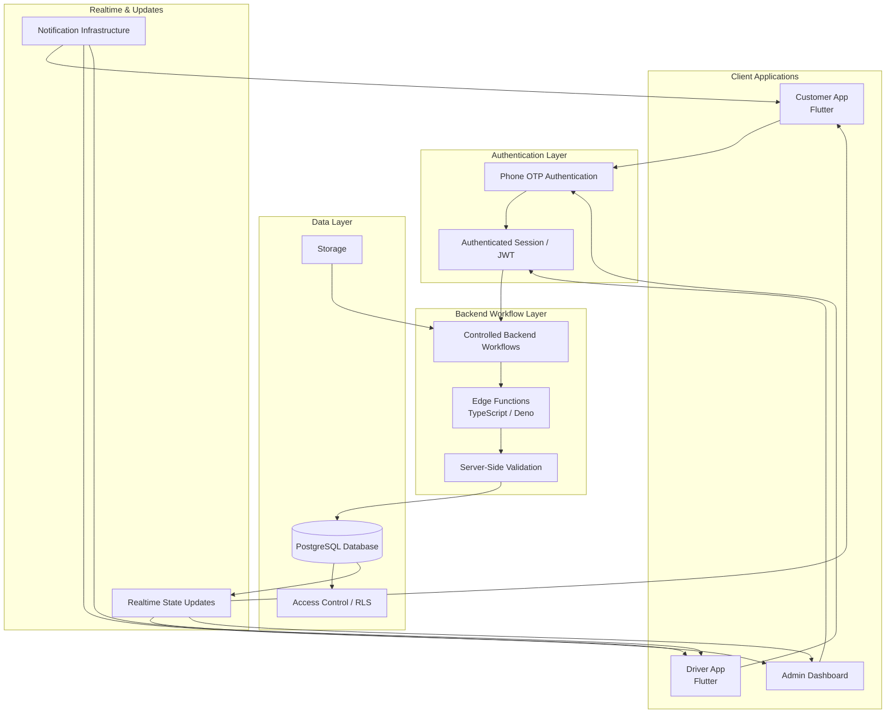

This diagram intentionally simplifies the architecture. Internal function names, database tables, access rules, and workflow logic are not disclosed.

---

## Architecture Style

Jeerah is designed as a **modular, state-driven, cloud-backed platform**.

### Main Characteristics

- Mobile-first frontend
- Supabase-backed backend
- PostgreSQL relational data model
- Server-side workflow validation
- Phone OTP authentication
- Role-aware user experiences
- State-machine-like order and trip progression
- Admin monitoring layer
- Separation between public clients and private business logic

### Why This Style Fits Jeerah

Jeerah is not just a CRUD application. It includes multiple actors, multi-step workflows, dynamic payment states, invoice submission, driver actions, customer actions, and admin oversight.

A state-driven architecture is suitable because every order and trip must move through controlled transitions.

---

## Core System Layers

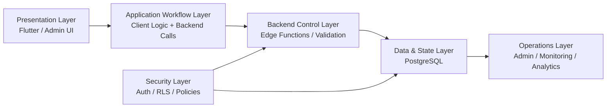

### Layer Summary

| Layer | Responsibility |
|---|---|
| Presentation Layer | User interface for customer, driver, and admin |
| Application Workflow Layer | Client-side user flow and interaction handling |
| Backend Control Layer | Sensitive validation and controlled workflow actions |
| Data & State Layer | Persistent order, trip, user, payment, and operational state |
| Security Layer | Authentication, role separation, and access control |
| Operations Layer | Admin monitoring, support, and future analytics |

---

# Client Layer

The client layer contains the user-facing applications.

Jeerah currently focuses on:

- Customer app
- Driver app
- Admin dashboard

The client layer is responsible for displaying data, collecting user actions, and requesting backend operations. It should not own sensitive business logic such as pricing, trip-pooling, earnings rules, or payment validation.

---

## Customer App Architecture

The customer app is designed around the customer journey:

1. Authenticate
2. Create order
3. Wait for trip progress
4. Review final amount
5. Select payment method
6. Track pickup and delivery
7. Receive completed order

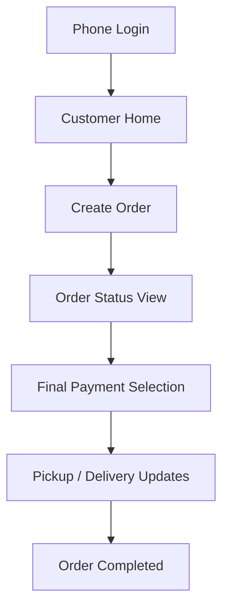

### Customer App Responsibilities

| Responsibility | Description |
|---|---|
| UI rendering | Show customer screens and order states |
| Input collection | Collect order and delivery information |
| Auth flow | Handle phone OTP login experience |
| Status display | Show current order lifecycle state |
| Payment choice | Allow customer to choose final payment method |
| Realtime updates | Reflect lifecycle changes in the app |

### Customer App Non-Responsibilities

The customer app should not expose:

- Payment provider internals
- Pricing formula
- Trip matching criteria
- Delivery fee algorithm
- Database structure
- Admin-only data
- Driver-only workflow rules

---

## Driver App Architecture

The driver app is designed around operational execution.

A driver needs to understand:

- What trip is available
- What orders are included
- What action is required next
- When to submit invoice details
- When to pick up
- When to start delivery
- When to complete delivery

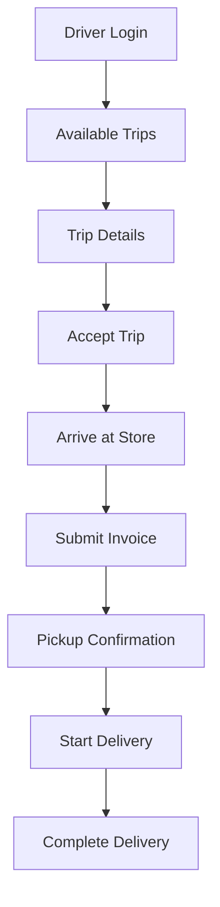

### Driver App Responsibilities

| Responsibility | Description |
|---|---|
| Trip discovery | Display available shared trips |
| Trip acceptance | Allow driver to accept a trip |
| Workflow progression | Move through required delivery stages |
| Invoice entry | Submit merchant invoice amount and optional image |
| Pickup handling | Confirm order pickup |
| Delivery progression | Start and complete delivery workflow |
| Status feedback | Display current action and trip state |

### Driver App Non-Responsibilities

The driver app should not expose:

- Driver earnings formula
- Internal matching logic
- Private customer data beyond operational needs
- Admin-only controls
- Database implementation
- Security policies
- Payment provider configuration

---

## Admin Dashboard Architecture

The admin dashboard is the operational view of the system.

It is intended to support:

- Monitoring active orders
- Monitoring active trips
- Reviewing drivers
- Reviewing customers
- Tracking payment-related states
- Handling support and exceptions
- Viewing future analytics

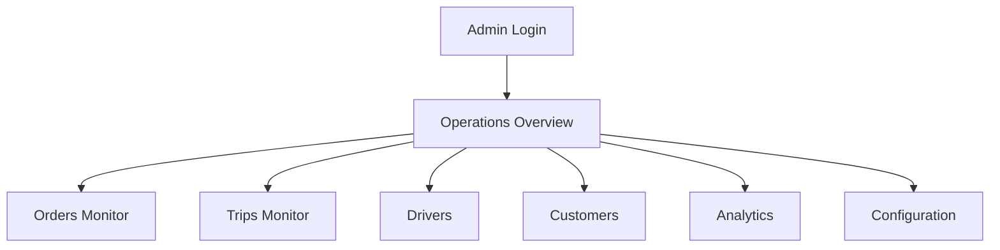

### Admin Dashboard Responsibilities

| Responsibility | Description |
|---|---|
| Operational visibility | View active order and trip activity |
| Support workflows | Help resolve customer or driver issues |
| Driver monitoring | Review driver participation and status |
| Order monitoring | Inspect order lifecycle progression |
| Payment visibility | Review high-level payment state |
| Analytics foundation | Support future reporting and performance views |

### Admin Dashboard Non-Responsibilities

The public documentation does not include:

- Admin authentication implementation
- Admin permission matrix
- Internal dashboard API details
- Database queries
- Production admin workflows
- Sensitive business controls

---

# Backend Layer

The backend layer is responsible for controlled business workflows.

Jeerah uses a backend layer to ensure that sensitive operations do not depend entirely on client-side logic.

---

## Backend Responsibilities

| Responsibility | Description |
|---|---|
| Validate actions | Ensure user actions are allowed and valid |
| Enforce workflow rules | Prevent invalid lifecycle transitions |
| Protect sensitive logic | Keep pricing, pooling, and payment rules private |
| Coordinate state changes | Update order and trip states safely |
| Support payment progression | Handle payment-related state transitions |
| Support invoice workflow | Validate invoice-related actions |
| Enable admin operations | Support operational visibility and controls |

---

## Backend Workflow Pattern

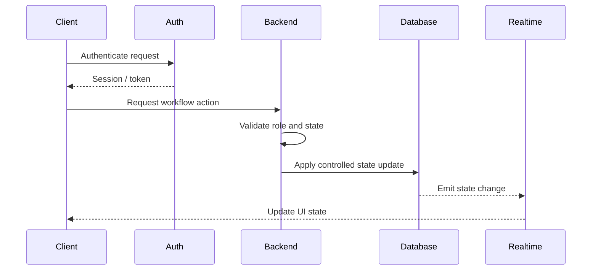

---

## Edge Functions

Edge Functions are used for server-side operations that should not be controlled purely from the client.

### Edge Function Use Cases

Publicly shareable examples include:

- Controlled workflow transitions
- Server-side validation
- Secure state updates
- Payment workflow support
- Invoice workflow support
- Operational backend actions

### Private Edge Function Details

The following are not disclosed:

- Function names
- Source code
- Validation implementation
- Environment variables
- Payment provider integration
- Internal business rules
- Deployment configuration

---

# Data Layer

The data layer is powered by PostgreSQL.

The database stores the core state of the platform, including user entities, orders, trips, payment states, delivery states, and operational data.

---

## Data Layer Responsibilities

| Responsibility | Description |
|---|---|
| Persistence | Store application records reliably |
| Lifecycle state | Track order and trip progression |
| Relational structure | Maintain relationships between entities |
| Access control | Restrict data access by role and context |
| Realtime updates | Support state-based UI updates |
| Reporting foundation | Enable future analytics and monitoring |

---

## High-Level Entity Model

This is a simplified public model and does not represent the actual production schema.

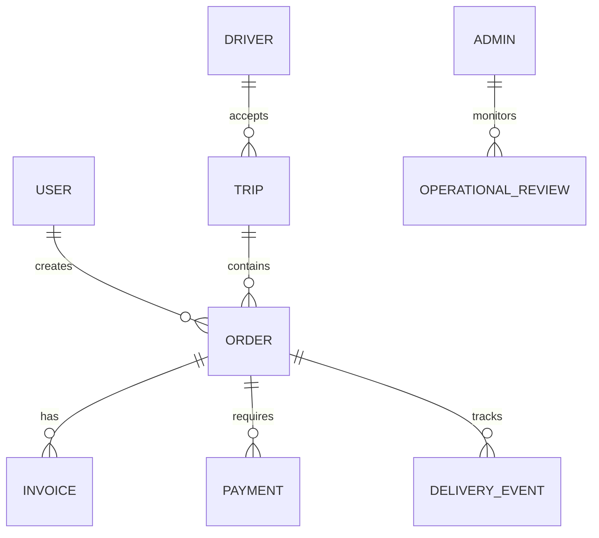

### Public Entity Categories

| Category | Description |
|---|---|
| Users | Customer and account identity foundation |
| Drivers | Driver profile and workflow participation |
| Orders | Customer delivery requests |
| Trips | Shared driver delivery journeys |
| Invoices | Merchant invoice details submitted by driver |
| Payments | Payment method and final payment state |
| Delivery Events | Lifecycle progress and operational tracking |
| Admin Records | Future operational review and management records |

### Important Note

The actual database schema is private and is not included in this repository.

This includes:

- Table names
- Column names
- Relationships
- Indexes
- Triggers
- Policies
- Migrations
- SQL files
- Access rules

---

# Authentication Layer

Jeerah uses phone-based authentication as the primary access mechanism.

---

## Authentication Flow

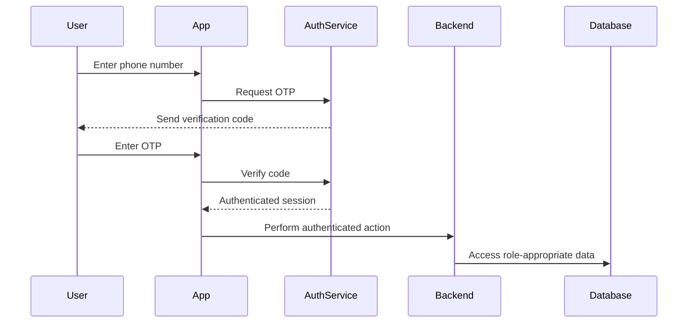

---

## Authentication Goals

| Goal | Description |
|---|---|
| Low friction | Phone OTP is simple for local mobile users |
| Secure identity | Actions are tied to authenticated accounts |
| Role separation | Customer, driver, and admin experiences are separated |
| Session continuity | Users can remain signed in across app sessions |
| Backend trust | Backend workflows rely on verified user identity |

---

# Realtime Layer

Realtime updates help keep customer, driver, and admin screens synchronized with lifecycle changes.

---

## Realtime Use Cases

| Use Case | Description |
|---|---|
| Customer order status | Customer sees order state changes |
| Driver workflow updates | Driver sees trip/order progression |
| Admin monitoring | Admin sees operational status updates |
| Payment state changes | Relevant views update after payment selection |
| Pickup/delivery changes | Apps reflect driver progression |

---

## Realtime Flow

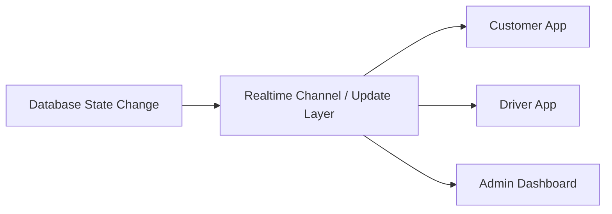

---

## Realtime Constraints

Realtime updates should not replace backend validation.

The backend remains responsible for deciding whether an action is valid. Realtime simply helps clients reflect updated state.

---

# Storage Layer

Jeerah may use storage for user-submitted or operational files such as invoice images.

---

## Storage Responsibilities

| Responsibility | Description |
|---|---|
| File upload | Store operational images when needed |
| Access control | Restrict who can access files |
| Metadata linking | Associate uploaded files with operational records |
| Future review | Support admin review workflows |

---

## Storage Security

Public documentation does not include:

- Bucket names
- Storage policies
- Upload rules
- File path conventions
- Signed URL logic
- Private access configuration

---

# Admin Layer

The admin layer is designed as the operational control surface of Jeerah.

---

## Admin Architecture Goals

- Provide visibility into active platform operations
- Support manual review of exceptions
- Help customer support resolve issues
- Monitor order and trip progress
- Support future analytics and reporting
- Protect admin-only privileges

---

## Admin Data Access Concept

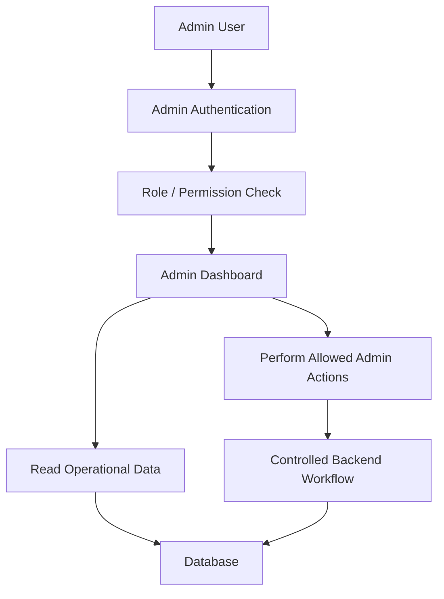

The actual admin permission model is private.

---

# Order Lifecycle Architecture

Orders in Jeerah are lifecycle-driven.

An order should not randomly move from one state to another. It should follow a controlled path based on customer actions, driver actions, payment state, and backend validation.

---

## Simplified Public Order State Flow

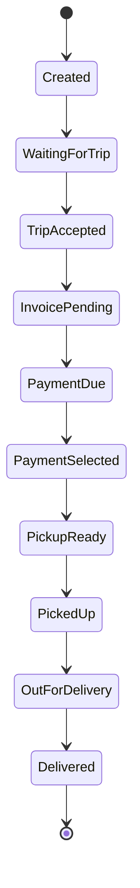

This is a simplified public flow. Real implementation may include more states, validations, exceptions, and administrative paths.

---

## Order Lifecycle Responsibilities

| Component | Responsibility |
|---|---|
| Customer App | Creates order and responds to required payment steps |
| Driver App | Performs pickup, invoice, and delivery actions |
| Backend | Validates allowed state transitions |
| Database | Stores current lifecycle state |
| Admin Dashboard | Monitors lifecycle progress |
| Realtime Layer | Broadcasts state changes to relevant clients |

---

# Trip Lifecycle Architecture

Trips represent grouped delivery journeys.

A trip may contain one or more orders. The driver interacts primarily with the trip workflow, while each order still maintains its own state.

---

## Simplified Public Trip State Flow

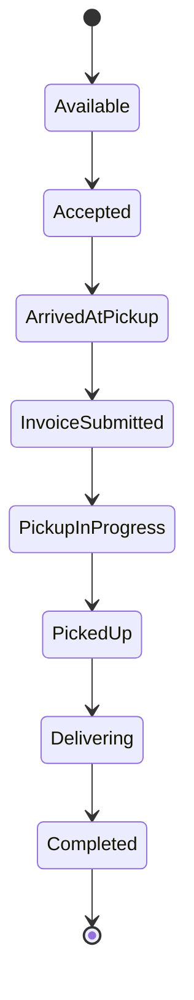

---

## Trip Lifecycle Responsibilities

| Component | Responsibility |
|---|---|
| Driver App | Accepts and executes trip workflow |
| Backend | Controls trip state transitions |
| Database | Stores trip and linked order states |
| Customer App | Displays relevant order progress |
| Admin Dashboard | Monitors active trips |
| Realtime Layer | Sends state updates |

---

# Payment Workflow Architecture

Payment workflow is designed to support final amount selection after invoice-related workflow steps.

---

## Simplified Payment Flow

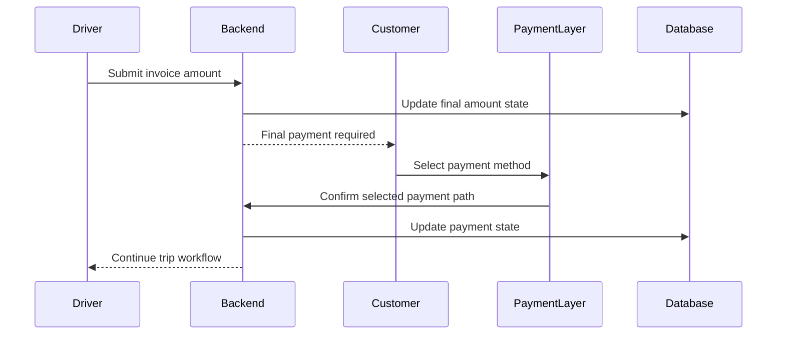

---

## Payment Architecture Goals

- Keep payment workflow controlled
- Allow final payment after invoice details are known
- Support online and cash payment paths
- Prevent invalid payment state transitions
- Keep provider-specific implementation private
- Support future reconciliation and analytics

---

## Private Payment Details

This repository does not include:

- Payment provider integration code
- Webhook implementation
- Payment token handling
- Merchant account configuration
- Payment verification rules
- Reconciliation logic
- Pricing formula
- Final amount calculation implementation

---

# Invoice Workflow Architecture

Invoice workflow allows the driver to submit merchant invoice details during the trip.

---

## Simplified Invoice Flow

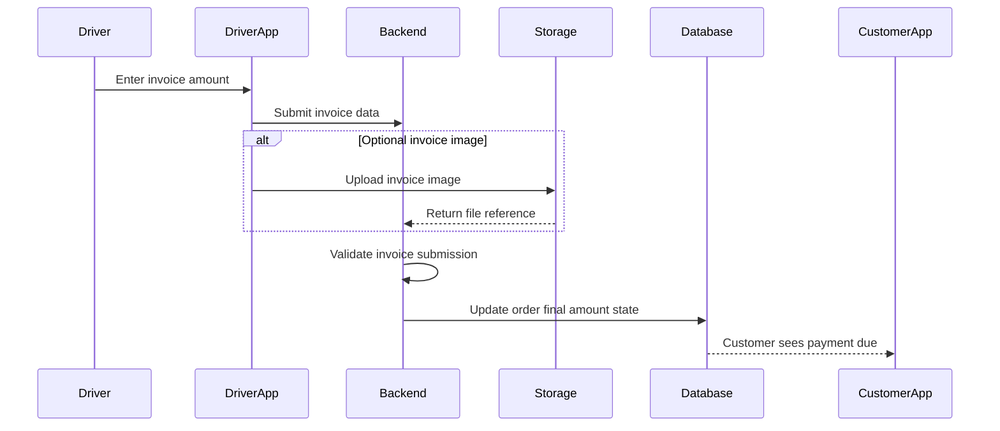

---

## Invoice Architecture Goals

- Support real-world merchant purchase flow
- Allow amount-only submission
- Support optional image evidence
- Link invoice details to the correct order
- Trigger final payment workflow
- Maintain backend validation
- Prepare for future admin review

---

# Security Architecture

Security in Jeerah is based on several layers:

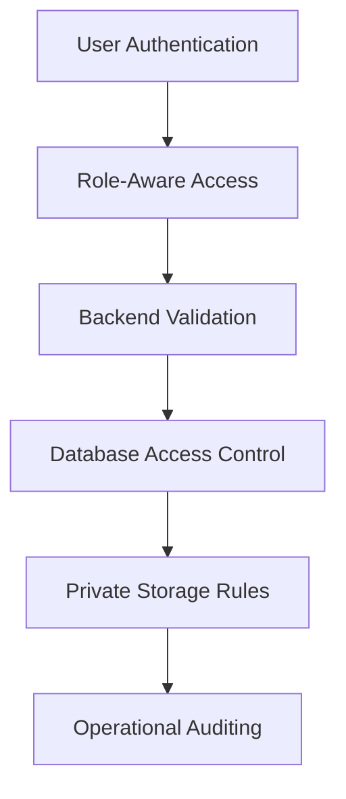

---

## Security Layers

| Layer | Description |
|---|---|
| Authentication | Verifies user identity |
| Authorization | Controls what each role can access |
| Backend Validation | Ensures actions are allowed |
| Database Security | Restricts direct data access |
| Storage Security | Protects operational files |
| Secret Management | Keeps credentials out of public repository |
| Commercial Protection | Keeps business logic private |

---

## Security Principles

Jeerah follows these principles:

- Never expose secrets in client apps
- Avoid trusting client-side logic for sensitive operations
- Keep critical workflows server-side
- Separate customer, driver, and admin privileges
- Restrict database access by authenticated context
- Keep environment configuration private
- Avoid publishing production infrastructure details

---

## Public Security Disclosure Boundary

Publicly shareable:

- High-level security approach
- Authentication model concept
- Role separation concept
- Secure backend workflow concept

Not publicly shareable:

- RLS policies
- SQL migrations
- Role matrices
- Access tokens
- Storage policies
- Production configuration
- Admin permission implementation
- Payment security implementation

---

# Scalability Architecture

Jeerah is designed to support future growth across users, orders, regions, and operational complexity.

---

## Scalability Dimensions

| Dimension | Consideration |
|---|---|
| Users | More customers and drivers |
| Orders | Higher order volume |
| Trips | More shared trips running concurrently |
| Regions | Expansion across multiple areas |
| Admin Operations | More monitoring and support tools |
| Analytics | More reporting and business intelligence |
| Notifications | Higher update volume |
| Payments | More transaction events |

---

## Scalability Strategy

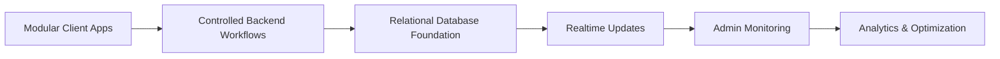

### Key Ideas

- Keep frontend apps focused on user experience
- Keep sensitive operations in backend workflows
- Model orders and trips cleanly in the database
- Use state transitions to reduce ambiguity
- Prepare admin tooling for scale
- Introduce monitoring and analytics as the platform grows

---

# Reliability Considerations

Jeerah's reliability depends on predictable lifecycle behavior.

---

## Reliability Focus Areas

| Area | Why It Matters |
|---|---|
| State transitions | Prevent orders from entering invalid states |
| Driver workflow | Ensure drivers always know the next step |
| Payment workflow | Avoid payment/order mismatch |
| Invoice submission | Ensure final amount flow is reliable |
| Realtime updates | Keep users informed |
| Admin monitoring | Detect issues early |
| Error handling | Recover from failed operations |

---

## Reliability Principles

- Validate state transitions
- Avoid duplicate critical actions
- Keep important operations idempotent where possible
- Show clear UI feedback
- Store lifecycle state persistently
- Prepare for network interruptions
- Support future manual admin intervention

---

# Observability Considerations

Observability is important for operating Jeerah as a commercial platform.

---

## Future Observability Areas

| Area | Example |
|---|---|
| Application logs | Track backend workflow execution |
| Error monitoring | Detect failed actions and exceptions |
| Performance metrics | Measure response time and bottlenecks |
| Order analytics | Track lifecycle completion and delays |
| Driver analytics | Track acceptance and completion patterns |
| Payment analytics | Track payment state progression |
| Operational dashboards | Give admins visibility into platform health |

---

## Observability Goals

- Detect operational issues quickly
- Understand where workflow delays occur
- Improve customer and driver experience
- Support business decisions
- Prepare for production scaling

---

# Data Flow Examples

The following examples show simplified public data flows.

---

## Customer Creates Order

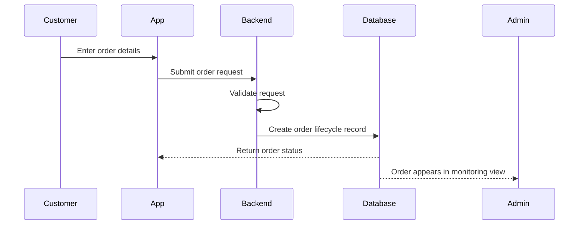

---

## Driver Accepts Shared Trip

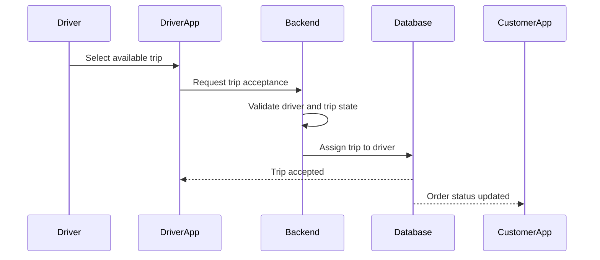

---

## Driver Submits Invoice

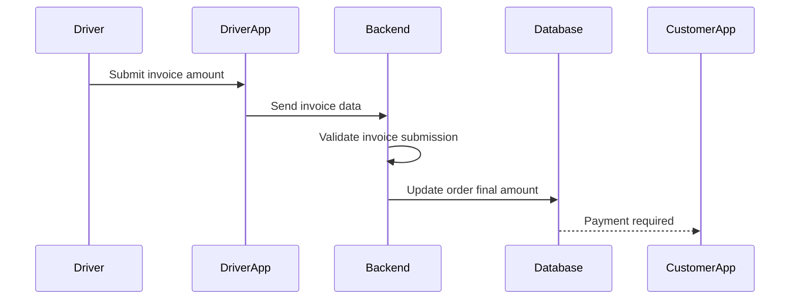

---

## Customer Selects Payment Method

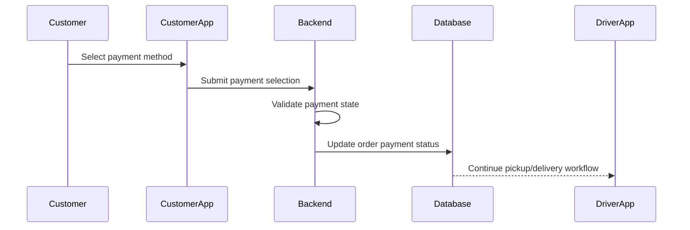

---

# Public vs Private Architecture

Because Jeerah is a commercial product, the public repository intentionally separates what can be shared from what must remain private.

---

## Publicly Shared

| Area | Public Level |
|---|---|
| Product vision | High-level |
| Technology stack | High-level |
| Architecture diagrams | Simplified |
| User journeys | Simplified |
| Order lifecycle | Simplified |
| Trip lifecycle | Simplified |
| Feature list | High-level |
| Security approach | High-level |
| Roadmap | High-level |

---

## Kept Private

| Area | Reason |
|---|---|
| Source code | Commercial IP |
| Database schema | Sensitive implementation detail |
| RLS policies | Security-sensitive |
| Edge Functions | Business logic |
| Payment code | Financial/security risk |
| Pricing logic | Commercial sensitivity |
| Trip-pooling algorithm | Core product IP |
| Driver earnings formula | Commercial sensitivity |
| Admin permission model | Security-sensitive |
| Environment variables | Secret credentials |
| Deployment configuration | Operational security |

---

# Architecture Decisions

This section documents public architecture decisions without exposing private implementation details.

---

## Decision 1: Flutter for Mobile Apps

### Context

Jeerah requires customer and driver mobile experiences. Building separate native applications would increase development complexity.

### Decision

Use Flutter as the primary mobile development framework.

### Rationale

- Single codebase for multiple platforms
- Strong UI development capability
- Fast iteration
- Suitable for startup/MVP development
- Good ecosystem for mobile workflows

---

## Decision 2: Supabase for Backend Foundation

### Context

The platform requires authentication, database, realtime updates, storage, and server-side workflows.

### Decision

Use Supabase as the backend foundation.

### Rationale

- PostgreSQL database
- Built-in authentication
- Realtime capabilities
- Edge Functions
- Storage support
- Fast development velocity
- Suitable for MVP and early commercial product development

---

## Decision 3: PostgreSQL for Relational Data

### Context

Jeerah depends on structured relationships between users, drivers, orders, trips, payments, invoices, and delivery events.

### Decision

Use PostgreSQL as the primary database.

### Rationale

- Strong relational modeling
- Transactional integrity
- Mature ecosystem
- Query flexibility
- Suitable for operational systems
- Works well with Supabase

---

## Decision 4: State-Driven Order and Trip Workflows

### Context

Delivery systems require predictable workflow progression. Invalid state changes can create operational and financial issues.

### Decision

Model orders and trips around controlled lifecycle states.

### Rationale

- Clear workflow logic
- Easier debugging
- Better admin monitoring
- More reliable customer/driver updates
- Better foundation for analytics

---

## Decision 5: Keep Sensitive Logic Server-Side

### Context

Pricing, payment handling, trip-pooling, driver earnings, and state validation are commercially and operationally sensitive.

### Decision

Sensitive workflows should be handled through backend-controlled logic rather than exposed in public clients.

### Rationale

- Protect business model
- Improve security
- Reduce tampering risk
- Improve maintainability
- Support future scaling

---

# Future Architecture Improvements

Future architecture improvements may include:

## Backend

- Stronger workflow orchestration
- More robust error handling
- Background job processing
- Payment reconciliation services
- Notification service abstraction
- Audit logs
- Admin action history

## Data

- Analytics-friendly reporting layer
- Performance indexes
- Operational event history
- Data retention rules
- Regional segmentation support

## Mobile

- Improved offline handling
- Better loading and retry states
- Driver navigation enhancements
- Customer live tracking
- Push notification integration

## Admin

- Role-based admin access
- Better dashboards
- Operational alerts
- Manual intervention tools
- Support case management
- Analytics and reporting views

## Infrastructure

- Production monitoring
- Error tracking
- CI/CD pipeline
- Environment separation
- Automated testing
- Backup strategy
- Incident response process

---

# Architecture Summary

Jeerah's architecture is designed to support a real commercial logistics product, not just a simple demo application.

The system is built around:

- Flutter mobile applications
- Supabase backend services
- PostgreSQL data foundation
- Phone OTP authentication
- Secure server-side workflow validation
- State-driven order and trip lifecycle
- Public customer and driver interfaces
- Admin operational visibility
- Private commercial logic protection

The architecture balances speed of development, commercial protection, security, and future scalability.

---

## Related Documents

- [`README.md`](README.md)
- [`FEATURES.md`](FEATURES.md)
- [`SYSTEM_DESIGN.md`](SYSTEM_DESIGN.md)
- [`ROADMAP.md`](ROADMAP.md)
- [`SECURITY.md`](SECURITY.md)
- [`NOTICE.md`](NOTICE.md)
- [`LICENSE.md`](LICENSE.md)

---

<div align="center">

**Jeerah Architecture**

*A scalable mobile-first logistics architecture for smart shared delivery in remote communities.*

</div>
