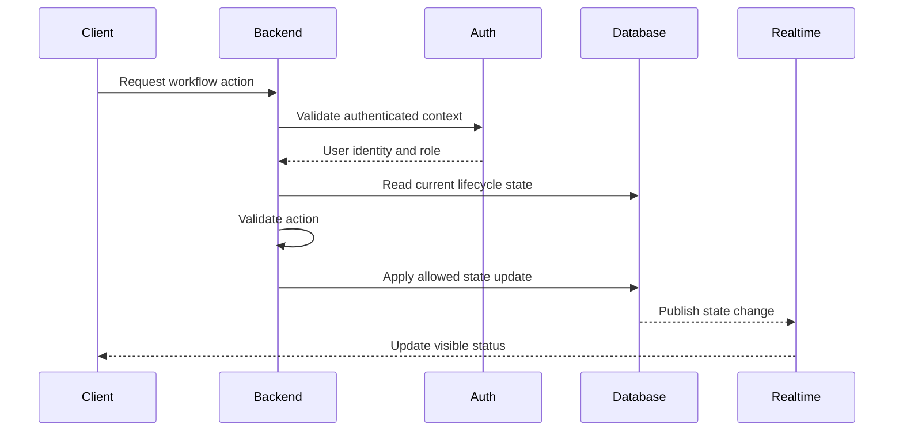

# Jeerah Backend

> Public backend overview for **Jeerah**, a smart trip-pooling delivery platform.

---

## Repository Notice

This document explains the backend at a high level only.

It does not include backend source code, Supabase Edge Functions, environment variables, database schema, RLS policies, payment code, trip-pooling algorithm, pricing logic, or deployment configuration.

---

## Backend Overview

The Jeerah backend is responsible for coordinating secure workflows between the customer app, driver app, admin dashboard, database, authentication system, storage, and realtime updates.

The backend exists to ensure that critical delivery operations are validated and controlled server-side rather than trusted entirely to mobile clients.

---

## Backend Responsibilities

| Responsibility | Description |
|---|---|
| Authentication Context | Validate authenticated users |
| Role Awareness | Separate customer, driver, and admin workflows |
| Workflow Validation | Ensure actions are allowed in the current lifecycle state |
| Order Management | Coordinate order lifecycle transitions |
| Trip Management | Coordinate shared trip state |
| Invoice Workflow | Validate invoice submission and related updates |
| Payment Workflow | Coordinate payment state progression |
| Storage Coordination | Support optional invoice images |
| Realtime Updates | Enable client-side status updates |
| Admin Support | Provide operational visibility foundations |

---

## High-Level Backend Flow

---

## Backend Design Principles

- Keep sensitive logic out of mobile clients.
- Validate every critical workflow action.
- Treat database state as the source of truth.
- Do not expose pricing or pooling logic publicly.
- Avoid allowing direct lifecycle manipulation from clients.
- Keep payment logic protected.
- Keep admin operations controlled.
- Prepare for production monitoring and logging.

---

## Backend Modules

Publicly described backend modules include:

| Module | Purpose |
|---|---|
| Auth Context | Identify the current user and role |
| Order Workflow | Manage order state transitions |
| Trip Workflow | Manage trip state transitions |
| Invoice Workflow | Handle driver invoice submissions |
| Payment Workflow | Handle payment selection states |
| Storage Workflow | Manage optional operational files |
| Admin Workflow | Support dashboard operations |
| Notification Workflow | Support future event-based updates |

---

## Edge Functions

Jeerah may use Edge Functions for secure server-side workflows.

Public examples of function responsibilities:

- Validate state transitions
- Handle invoice workflow
- Handle payment workflow
- Protect sensitive operations
- Coordinate multi-entity updates
- Support admin actions

Private details not disclosed:

- Function names
- Function source code
- Request/response payloads
- Environment variables
- Payment integrations
- Internal validation logic

---

## Backend Non-Disclosure

This repository does not include:

- Backend source files
- Supabase functions
- Internal APIs
- Service role keys
- Payment provider code
- Secret configuration
- Production URLs
- Logs
- Webhook implementation

---

## Future Backend Improvements

- Stronger error logging
- Audit logs
- Admin action history
- Background jobs
- Notification service abstraction
- Payment reconciliation
- Rate limiting
- Monitoring and alerting
- Automated testing
- CI/CD pipeline

---

## Summary

Jeerah's backend is the secure control layer of the platform.

It protects lifecycle transitions, coordinates orders and trips, validates user actions, and keeps sensitive commercial logic private.

---

## Related Documents

- [`ARCHITECTURE.md`](ARCHITECTURE.md)
- [`SYSTEM_DESIGN.md`](SYSTEM_DESIGN.md)
- [`SECURITY.md`](SECURITY.md)
- [`DATABASE.md`](DATABASE.md)
- [`API.md`](API.md)

---

**Jeerah Backend**

*Secure workflow control for smart shared delivery.*

