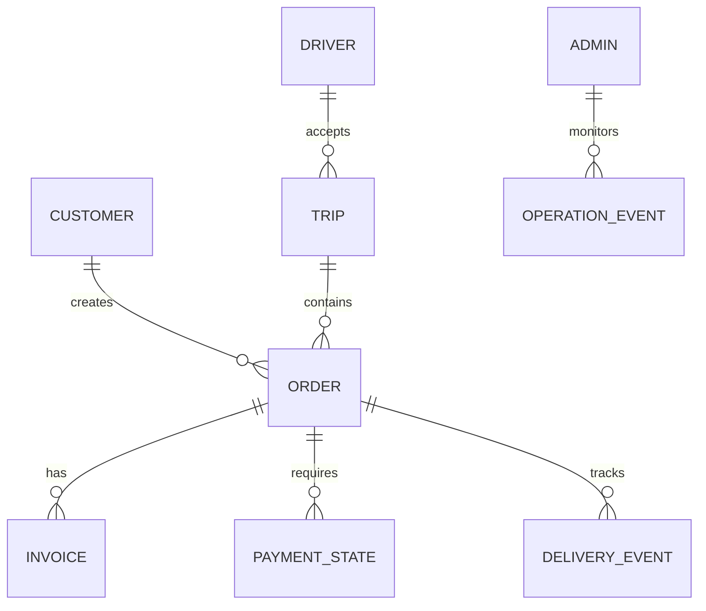
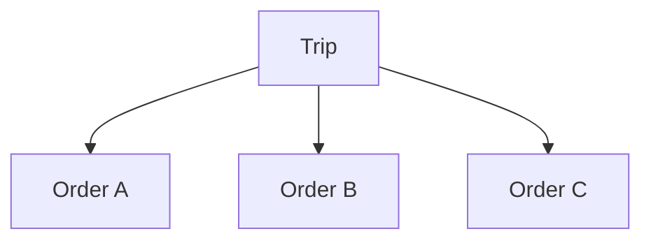

# Jeerah Database

> Public database design overview for **Jeerah**, a smart trip-pooling delivery platform.

---

## Repository Notice

This document does not include the production database schema.

It does not disclose table names, column names, SQL migrations, Row Level Security policies, database functions, triggers, indexes, internal enum values, Supabase configuration, or any sensitive implementation detail.

This document explains the database design principles at a high level only.

---

## Database Overview

Jeerah uses a relational database foundation to support structured relationships between customers, drivers, orders, trips, invoices, payment states, and delivery events.

The database is responsible for storing the source of truth for order and trip lifecycles.

---

## Public Data Categories

| Category | Description |
|---|---|
| Users | Customer, driver, and admin identity foundation |
| Customers | Customer-facing account and order ownership data |
| Drivers | Driver workflow and trip participation data |
| Orders | Customer delivery requests |
| Trips | Shared delivery journeys |
| Invoices | Merchant invoice information submitted by driver |
| Payments | Payment method and state tracking |
| Delivery Events | Lifecycle and progress events |
| Admin Operations | Monitoring and support data |
| Analytics Data | Future reporting and performance insights |

---

## Simplified Public Entity Model

This diagram is intentionally simplified and does not represent the production schema.

---

## Database Design Principles

- Model orders and trips as lifecycle-driven entities.
- Keep customer, driver, and admin data access separated.
- Support one trip containing multiple orders.
- Support invoice records linked to orders.
- Support payment state progression.
- Support delivery event tracking.
- Prepare data for future analytics.
- Keep sensitive schema details private.

---

## Order and Trip Relationship

Jeerah separates orders from trips.

An order represents a customer request.

A trip represents a driver journey that may contain one or more orders.

This separation is essential because Jeerah is based on smart shared trips.

---

## Lifecycle Data

The database supports structured lifecycle states.

Examples of public lifecycle areas:

- Order created
- Waiting for trip
- Trip accepted
- Invoice submitted
- Payment required
- Payment selected
- Picked up
- Out for delivery
- Delivered

Actual state names and internal enums are private.

---

## Security and Access Control

The database should enforce role-aware data access.

Public principles:

- Customers access their own orders.
- Drivers access relevant trips and operational order data.
- Admins access operational views based on permissions.
- Backend workflows validate sensitive writes.
- Direct lifecycle manipulation should be restricted.
- RLS policies are private.

---

## What Is Not Included

This repository does not include:

- SQL schema
- Migrations
- Table definitions
- Column definitions
- Row Level Security policies
- Indexes
- Triggers
- Stored procedures
- Views
- Database dumps
- Production data
- Supabase configuration

---

## Future Database Improvements

- Analytics tables or views
- Audit log records
- Admin action history
- Better reporting support
- Regional segmentation
- Performance indexing
- Data retention policies
- Backup and recovery strategy

---

## Summary

Jeerah's database is designed to support a real delivery platform with structured lifecycles and multiple actors.

The public documentation describes the design direction without exposing private schema details.

---

**Jeerah Database**

*Lifecycle-driven relational data design for smart shared delivery.*

