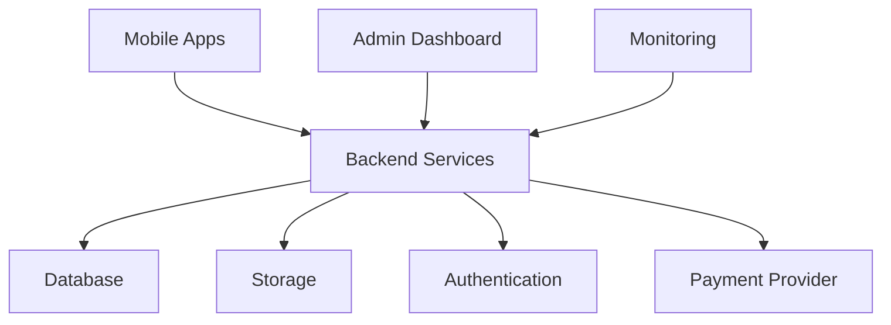

# Jeerah Deployment

> Public deployment overview for **Jeerah**, a commercial smart trip-pooling delivery platform.

---

## Repository Notice

This document does not include production deployment instructions.

It does not disclose environment variables, Supabase project configuration, deployment scripts, CI/CD secrets, database URLs, API keys, payment keys, service-role keys, or infrastructure credentials.

This document provides only a high-level deployment strategy.

---

## Deployment Overview

Jeerah deployment involves multiple layers:

- Mobile application builds
- Backend service deployment
- Database environment
- Storage configuration
- Authentication configuration
- Payment configuration
- Admin dashboard deployment
- Monitoring and logging
- Production secrets management

The production implementation is private.

---

## Environment Strategy

A commercial deployment should separate environments:

| Environment | Purpose |
|---|---|
| Local | Development and experimentation |
| Staging | Testing near-production workflows |
| Production | Real customer and driver operations |

---

## Public Deployment Architecture

This diagram is simplified and not a production infrastructure map.

---

## Deployment Principles

- Never commit secrets.
- Keep staging and production separate.
- Use environment variables for configuration.
- Restrict production database access.
- Protect payment provider credentials.
- Use safe migration practices.
- Back up production data.
- Monitor errors and performance.
- Review security before launch.

---

## Mobile Deployment

Future production mobile deployment may involve:

- Android build preparation
- iOS build preparation
- App signing
- Store listing assets
- App review requirements
- Version management
- Release notes
- Beta testing channels

---

## Backend Deployment

Backend deployment should consider:

- Function deployment
- Environment variable management
- Database migrations
- Auth configuration
- Storage configuration
- Payment integration
- Monitoring
- Rollback strategy

---

## Pre-Launch Checklist

Before production launch:

- [ ] Security review completed
- [ ] No secrets in repository
- [ ] Environment separation verified
- [ ] Payment workflow tested
- [ ] Order lifecycle tested
- [ ] Trip lifecycle tested
- [ ] Admin monitoring available
- [ ] Backup strategy prepared
- [ ] Error monitoring enabled
- [ ] Support process ready
- [ ] Beta test completed

---

## What Is Not Included

This repository does not include:

- Deployment scripts
- Production URLs
- Supabase config
- Environment variables
- CI/CD files with secrets
- Database connection strings
- Payment credentials
- Service-role keys
- Hosting provider configuration

---

## Summary

Jeerah's deployment strategy should prioritize security, environment separation, operational reliability, and controlled launch readiness.

The public repository intentionally does not provide executable deployment instructions.

---

**Jeerah Deployment**

*High-level strategy only. Production deployment remains private.*

