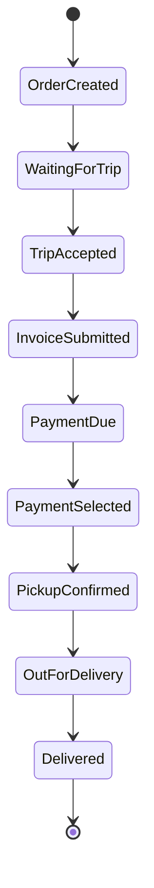
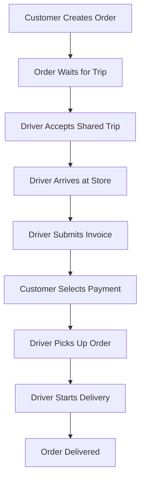

# Jeerah Features

> A detailed public feature overview for **Jeerah**, a smart trip-pooling delivery platform for remote communities.

---

## Repository Notice

This document is part of the public showcase repository for Jeerah.

It describes the product features at a high level without exposing private source code, proprietary algorithms, database schema, pricing formulas, payment implementation, Supabase configuration, Row Level Security policies, Edge Functions, or any sensitive business logic.

Jeerah is a commercial product under active development. This file is intended for portfolio, technical presentation, and product explanation purposes only.

---

## Table of Contents

- [Feature Philosophy](#feature-philosophy)
- [Feature Status Legend](#feature-status-legend)
- [Product Areas](#product-areas)
- [Customer Application Features](#customer-application-features)
- [Driver Application Features](#driver-application-features)
- [Admin Dashboard Features](#admin-dashboard-features)
- [Authentication Features](#authentication-features)
- [Order Management Features](#order-management-features)
- [Trip-Pooling Features](#trip-pooling-features)
- [Payment Workflow Features](#payment-workflow-features)
- [Invoice Workflow Features](#invoice-workflow-features)
- [Delivery Lifecycle Features](#delivery-lifecycle-features)
- [Notification Features](#notification-features)
- [Security Features](#security-features)
- [Operational Features](#operational-features)
- [Analytics Features](#analytics-features)
- [Planned Features](#planned-features)
- [Features Not Publicly Disclosed](#features-not-publicly-disclosed)
- [Summary](#summary)

---

## Feature Philosophy

Jeerah is built around one central product idea:

> Delivery in remote and low-density communities should be economically viable for customers, drivers, and the platform.

Every feature in Jeerah is designed to support one or more of the following goals:

1. Reduce delivery cost for customers.
2. Increase the value of each driver trip.
3. Improve delivery reliability in underserved areas.
4. Reduce manual coordination.
5. Provide clear order and trip visibility.
6. Build a scalable foundation for commercial operations.
7. Protect sensitive business logic and operational rules.

The platform does not attempt to copy urban delivery applications directly. Instead, it is designed around the realities of village and remote-area logistics where order density is lower and trip economics are more difficult.

---

## Feature Status Legend

| Status | Meaning |
|---|---|
| Completed | Feature foundation has been implemented and tested at a functional level |
| In Progress | Feature is currently being built or refined |
| Planned | Feature is part of the product roadmap |
| Private | Feature exists conceptually or technically but is not publicly documented in detail |

---

## Product Areas

Jeerah is divided into several major product areas:

| Product Area | Purpose |
|---|---|
| Customer App | Allows customers to create and track delivery orders |
| Driver App | Allows drivers to accept and execute shared trips |
| Admin Dashboard | Allows operational monitoring and management |
| Backend Services | Handles secure workflows and server-side logic |
| Database Layer | Stores core platform data and lifecycle states |
| Authentication | Handles phone-based user access |
| Payment Workflow | Supports final payment selection and payment state handling |
| Trip Pooling | Supports shared delivery trip logic |
| Notifications | Keeps users updated about important order and trip changes |
| Analytics | Helps the business understand performance and operations |

---

# Customer Application Features

The customer application focuses on making order creation, payment, and delivery tracking simple and clear.

---

## Customer Account Access

| Feature | Description | Status |
|---|---|---|
| Phone Number Login | Customers can sign in using their phone number | Completed |
| OTP Verification | Customers authenticate using a one-time verification code | Completed |
| Session Handling | Customers remain authenticated across app sessions | Completed |
| Customer Profile Foundation | Basic customer identity and account foundation | Completed |

### Purpose

The customer authentication flow is designed to reduce onboarding friction. Phone-based login is more suitable for a local delivery application than traditional email/password registration.

---

## Customer Order Creation

| Feature | Description | Status |
|---|---|---|
| Order Request Creation | Customer can create a delivery request | Completed |
| Order Details Entry | Customer can describe what they want to order | Completed |
| Delivery Location Input | Customer can provide delivery destination details | Completed |
| Order Lifecycle Initialization | New orders enter a structured backend lifecycle | Completed |
| Validation Foundation | Order data is validated before lifecycle progression | Completed |

### Purpose

The order creation flow allows customers to request delivery without requiring them to understand the internal trip-pooling process.

The customer only needs to submit the required order information. The platform handles the operational workflow in the background.

---

## Customer Order Tracking

| Feature | Description | Status |
|---|---|---|
| Order Status Display | Customer can view the current status of an order | Completed |
| Lifecycle-Based Updates | Order status reflects backend state transitions | Completed |
| Trip Progress Visibility | Customer can see progress after driver trip actions | In Progress |
| Delivery Progress View | Customer receives progress updates through the order lifecycle | In Progress |

### Public Lifecycle Example



This public diagram is intentionally simplified. Internal validation rules and exception states are not published.

---

## Customer Payment Selection

| Feature | Description | Status |
|---|---|---|
| Final Payment Selection | Customer can choose how to pay after final amount is available | Completed |
| Online Payment Flow Foundation | Platform supports online payment workflow progression | Completed |
| Cash Payment Flow Foundation | Platform supports cash payment workflow progression | Completed |
| Final Amount Display | Customer can see final payable amount after invoice submission | Completed |
| Payment State Transition | Order can continue after payment selection | Completed |

### Purpose

Jeerah supports a delivery model where the final payable amount may depend on merchant invoice details and delivery logic. The platform allows the customer to choose the final payment method after the required order amount is confirmed.

Actual payment provider implementation details are private and are not included in this showcase repository.

---

## Customer Experience Goals

The customer app is designed to feel:

- Simple
- Fast
- Clear
- Reliable
- Local-market friendly
- Mobile-first
- Easy to understand even when the backend workflow is complex

The customer does not need to understand how trip pooling works internally. They only need clear order progress and payment steps.

---

# Driver Application Features

The driver application focuses on trip execution, invoice submission, pickup handling, and delivery progression.

---

## Driver Trip Discovery

| Feature | Description | Status |
|---|---|---|
| Available Trips View | Driver can view available shared trips | Completed |
| Trip Details Foundation | Driver can understand basic trip context before accepting | Completed |
| Shared Trip Acceptance | Driver can accept a trip containing multiple compatible orders | Completed |
| Driver Assignment | Accepted trip becomes assigned to the driver | Completed |

### Purpose

The driver should be able to identify valuable trips and accept them confidently.

Because Jeerah is designed for low-density areas, the trip must be attractive enough for drivers to participate consistently.

---

## Driver Trip Workflow

| Feature | Description | Status |
|---|---|---|
| Accept Trip | Driver accepts available shared trip | Completed |
| Arrive at Merchant/Store | Driver marks arrival at pickup location | Completed |
| View Orders in Trip | Driver can see orders associated with the trip | Completed |
| Submit Invoice Details | Driver submits invoice amount per order | Completed |
| Optional Invoice Image | Driver may attach an invoice image when needed | Completed |
| Confirm Pickup | Driver progresses order after pickup | Completed |
| Start Delivery | Driver starts delivery stage after pickup | Completed |
| Complete Delivery | Driver completes the delivery lifecycle | In Progress |

---

## Driver Invoice Submission

| Feature | Description | Status |
|---|---|---|
| Per-Order Invoice Input | Driver submits invoice data for each order in a trip | Completed |
| Amount-Only Submission | Driver can submit invoice amount without image | Completed |
| Optional Image Upload | Driver can attach invoice image optionally | Completed |
| Final Amount Calculation Trigger | Invoice submission triggers final customer amount workflow | Completed |
| Order State Progression | Order progresses to final payment requirement state | Completed |

### Purpose

Invoice submission is important because the final customer amount may depend on what the merchant/store actually charges.

The public repository does not include:

- Calculation formulas
- Pricing logic
- Delivery fee rules
- Payment state implementation
- Database schema
- Validation implementation

---

## Driver Experience Goals

The driver app is designed to support:

- Clear next-step actions
- Reduced confusion during shared trips
- Simple invoice submission
- Multi-order delivery handling
- Better trip value
- Lower manual communication
- Future earnings visibility

---

# Admin Dashboard Features

The admin dashboard supports operational oversight and business management.

The dashboard is part of the platform vision and is developed to help monitor orders, drivers, trips, and platform activity.

---

## Operational Monitoring

| Feature | Description | Status |
|---|---|---|
| Active Orders Monitoring | Admin can review active order states | In Progress |
| Active Trips Monitoring | Admin can review current trip progress | In Progress |
| Driver Monitoring | Admin can inspect driver activity and availability | Planned |
| Customer Monitoring | Admin can review customer account activity | Planned |
| Payment State Review | Admin can inspect high-level payment workflow status | Planned |
| Exception Handling | Admin can identify orders requiring manual attention | Planned |

---

## Admin Management Features

| Feature | Description | Status |
|---|---|---|
| User Management | Manage customer and account records | Planned |
| Driver Management | Review and manage drivers | Planned |
| Trip Management | Review shared trip status | In Progress |
| Order Management | Review and manage order lifecycle | In Progress |
| Configuration Tools | Manage high-level operational settings | Planned |
| Analytics Dashboard | View business and operational metrics | Planned |

### Purpose

The admin dashboard is intended to become the operational control center for Jeerah.

It helps the business manage delivery operations, customer support, driver workflows, and performance visibility.

---

# Authentication Features

Authentication is built around phone number access.

| Feature | Description | Status |
|---|---|---|
| Phone OTP Login | Users authenticate using phone number and OTP | Completed |
| Role-Aware Access Foundation | Different user types can access different experiences | Completed |
| Session Persistence | User session can remain active between app launches | Completed |
| Secure Backend Identity | Backend operations rely on authenticated user identity | Completed |

---

## Authentication Principles

Jeerah authentication is designed around:

- Low-friction onboarding
- Mobile-first identity
- Secure session handling
- Role-aware workflows
- Backend-controlled access
- Strong separation between customer and driver flows

The actual authentication configuration is private.

---

# Order Management Features

Order management is the core of the platform.

| Feature | Description | Status |
|---|---|---|
| Create Order | Customer creates a delivery order | Completed |
| Store Order State | Backend stores structured order lifecycle state | Completed |
| Update Order State | Order moves through controlled lifecycle transitions | Completed |
| Link Order to Trip | Orders can become part of a shared trip | Completed |
| Track Payment State | Order reflects payment workflow status | Completed |
| Track Pickup State | Order reflects pickup progress | Completed |
| Track Delivery State | Order reflects delivery progress | In Progress |
| Close Order | Order can be finalized after successful delivery | Planned |

---

## Order Management Goals

The order system is designed to:

- Keep the lifecycle predictable
- Prevent invalid state transitions
- Support shared trips
- Support customer payment progression
- Support driver workflow progression
- Support admin visibility
- Support future reporting and analytics

---

# Trip-Pooling Features

Trip pooling is the core product concept behind Jeerah.

---

## Public Trip-Pooling Description

Jeerah groups compatible orders into shared driver trips. This allows one driver to serve multiple customers within a structured delivery journey.

```text
Traditional Model:

Order A → Driver A
Order B → Driver B
Order C → Driver C

Jeerah Shared-Trip Model:

Order A
Order B  → Shared Trip → One Driver → Multiple Customers
Order C
```

---

## Trip-Pooling Capabilities

| Feature | Description | Status |
|---|---|---|
| Shared Trip Creation Foundation | Orders can be associated with shared trips | Completed |
| Multi-Order Trip Support | A trip may contain more than one order | Completed |
| Driver Trip Acceptance | Driver can accept shared trip | Completed |
| Trip State Management | Trip has its own lifecycle | Completed |
| Order-Trip Relationship | Orders and trips are linked in backend workflow | Completed |
| Capacity-Aware Concept | Platform concept supports trip limits | Private |
| Compatibility Rules | Platform uses business rules to determine trip compatibility | Private |
| Pooling Algorithm | Proprietary trip-pooling logic is private | Private |

---

## Why Trip Pooling Matters

Trip pooling improves:

- Cost efficiency
- Driver earnings potential
- Route value
- Delivery availability
- Platform scalability
- Rural logistics feasibility

---

## Private Trip-Pooling Details

The following details are intentionally not published:

- Matching rules
- Distance logic
- Capacity logic
- Timing rules
- Pricing influence
- Pooling constraints
- Optimization logic
- Database implementation
- Edge Function logic

---

# Payment Workflow Features

Jeerah includes a payment workflow that supports final amount handling and payment method selection.

---

## Payment Capabilities

| Feature | Description | Status |
|---|---|---|
| Final Amount Workflow | Final customer amount becomes available after invoice-related steps | Completed |
| Online Payment Selection | Customer can select online payment | Completed |
| Cash Payment Selection | Customer can select cash payment | Completed |
| Payment State Handling | Order progresses based on payment selection | Completed |
| Price Lock Concept | Final payable amount can be locked after payment workflow | Completed |
| Payment Provider Integration | Actual payment provider details are private | Private |

---

## Payment Workflow Goals

The payment workflow is designed to:

- Support real-world merchant invoice scenarios
- Keep customer payment transparent
- Allow delivery progression after payment selection
- Protect payment implementation details
- Support future online payment provider integration
- Maintain reliable order state transitions

---

# Invoice Workflow Features

Invoice submission is part of the driver-side workflow.

---

## Invoice Capabilities

| Feature | Description | Status |
|---|---|---|
| Submit Merchant Invoice Amount | Driver can submit merchant invoice amount | Completed |
| Optional Invoice Image | Driver can upload invoice image optionally | Completed |
| Amount-Only Flow | Driver can proceed with amount only | Completed |
| Per-Order Invoice Support | Driver handles invoice details per order | Completed |
| Customer Amount Update | Invoice details trigger final customer amount workflow | Completed |
| Admin Review Potential | Admin review can be added later | Planned |

---

## Invoice Workflow Purpose

In many real delivery scenarios, the final purchase amount may only be known after the driver reaches the merchant or store.

Jeerah supports this operational need by allowing the driver to submit invoice details before the customer finalizes payment selection.

---

# Delivery Lifecycle Features

The delivery lifecycle connects customer actions, driver actions, backend state, and admin monitoring.

---

## Public Delivery Lifecycle



---

## Delivery Capabilities

| Feature | Description | Status |
|---|---|---|
| Structured Order Lifecycle | Orders follow controlled states | Completed |
| Structured Trip Lifecycle | Trips follow controlled states | Completed |
| Driver Pickup Workflow | Driver can move order into pickup stage | Completed |
| Start Delivery Workflow | Driver can begin delivery stage | Completed |
| Complete Delivery Workflow | Driver completes final delivery actions | In Progress |
| Final Trip Closing | Trip is closed after successful completion | Planned |
| Driver Earnings Finalization | Earnings can be finalized after trip closure | Planned |

---

# Notification Features

Notifications are planned to improve customer, driver, and admin communication.

---

## Notification Roadmap

| Feature | Description | Status |
|---|---|---|
| Order Status Notifications | Notify customers when order status changes | Planned |
| Payment Required Notification | Notify customer when final payment is required | Planned |
| Driver Assignment Notification | Notify customer when driver accepts trip | Planned |
| Pickup Notification | Notify customer when order is picked up | Planned |
| Delivery Notification | Notify customer when order is out for delivery | Planned |
| Admin Alerts | Notify admin of operational exceptions | Planned |

---

## Notification Goals

Notifications should:

- Reduce customer uncertainty
- Reduce manual support requests
- Keep drivers aware of required actions
- Help admins detect operational issues
- Improve trust in the platform

---

# Security Features

Jeerah is designed with security and privacy in mind.

---

## Public Security Features

| Feature | Description | Status |
|---|---|---|
| OTP Authentication | Phone-based login with OTP | Completed |
| Authenticated Sessions | Users operate under authenticated sessions | Completed |
| Role-Aware Access | Different user types access different workflows | Completed |
| Server-Side Validation | Sensitive operations are validated server-side | Completed |
| Database Access Control | Database access is protected using managed security features | Completed |
| Private Environment Variables | Secrets are not stored in public repository | Completed |
| Private Backend Logic | Sensitive business logic is kept private | Completed |

---

## Security Non-Disclosure

This repository does not publish:

- RLS policies
- Database schema
- Supabase configuration
- Edge Function code
- Payment code
- API secrets
- Environment variables
- Production credentials
- Internal authorization rules

For more information, see `SECURITY.md`.

---

# Operational Features

Operational features are designed to help the platform run as a real delivery business.

---

## Operational Capabilities

| Feature | Description | Status |
|---|---|---|
| Order Monitoring | Track orders by lifecycle state | In Progress |
| Trip Monitoring | Track active trips and driver progress | In Progress |
| Driver Workflow Visibility | Understand driver actions across a trip | Planned |
| Customer Support View | Support customers with order status visibility | Planned |
| Manual Review Tools | Handle exceptional cases | Planned |
| Operational Reporting | View summary performance metrics | Planned |

---

# Analytics Features

Analytics will help the business understand performance, demand, driver activity, and delivery efficiency.

---

## Planned Analytics

| Metric Area | Example Insights | Status |
|---|---|---|
| Orders | Total orders, active orders, completed orders | Planned |
| Trips | Shared trip count, average orders per trip | Planned |
| Drivers | Acceptance rate, completion rate, earnings view | Planned |
| Customers | Repeat orders, active customer trends | Planned |
| Payments | Payment method distribution | Planned |
| Operations | Delays, cancellations, support cases | Planned |
| Geography | Regional demand and coverage | Planned |

---

## Analytics Purpose

Analytics will help Jeerah answer business questions such as:

- Which areas have the highest delivery demand?
- What time periods generate more orders?
- How many orders are included in a typical shared trip?
- Are drivers earning enough to remain active?
- Where do delivery delays occur?
- Which workflow stage needs improvement?

---

# Planned Features

The following features are planned for future development:

## Customer-Side

- Saved addresses
- Better order history
- Live location updates
- Delivery rating
- Customer support chat
- Promo and offer support
- Referral system

## Driver-Side

- Driver wallet
- Earnings dashboard
- Availability scheduling
- Driver performance metrics
- Trip history
- Improved route view
- In-app support tools

## Admin-Side

- Full operational dashboard
- Driver approval system
- Customer support tools
- Payment reconciliation
- Trip analytics
- Regional performance views
- Manual order intervention
- Role-based admin accounts

## Backend

- Advanced notification handling
- Enhanced logging
- Monitoring and alerting
- Automated exception detection
- Performance optimization
- Production-grade deployment pipeline

## Business

- Region expansion tools
- Merchant integration options
- Promotional campaigns
- Subscription or loyalty features
- Advanced pricing experiments

---

# Features Not Publicly Disclosed

To protect the commercial value of Jeerah, several feature areas are intentionally described only at a high level.

This includes:

- Trip-pooling algorithm
- Order matching rules
- Pricing model
- Delivery fee calculation
- Driver earnings calculation
- Payment provider implementation
- Merchant invoice validation rules
- Fraud prevention logic
- Database schema
- Backend Edge Functions
- Supabase policies
- Admin authorization rules
- Deployment configuration

These items are private intellectual property and are not suitable for a public showcase repository.

---

# Summary

Jeerah is not just a delivery application. It is a logistics system designed for a specific market need: making delivery work in remote and low-density communities.

The feature set is built around:

- Customers who need affordable delivery
- Drivers who need profitable trips
- A platform that needs scalable operations
- A backend that controls sensitive workflows
- A business model that depends on smart trip pooling

This document provides a public overview of the platform's features while protecting the implementation details that make Jeerah commercially valuable.

---

## Related Documents

- [`README.md`](README.md)
- [`ARCHITECTURE.md`](ARCHITECTURE.md)
- [`SYSTEM_DESIGN.md`](SYSTEM_DESIGN.md)
- [`ROADMAP.md`](ROADMAP.md)
- [`SECURITY.md`](SECURITY.md)
- [`NOTICE.md`](NOTICE.md)
- [`LICENSE.md`](LICENSE.md)

---

<div align="center">

**Jeerah — Smart delivery infrastructure for remote communities.**

</div>
