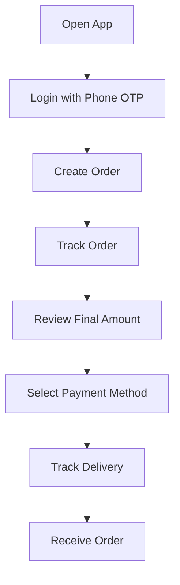
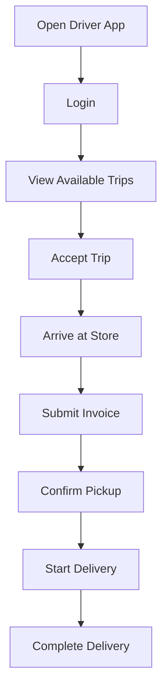

# Jeerah Mobile App

> Public mobile application overview for **Jeerah**, built around customer and driver workflows.

---

## Repository Notice

This document describes the mobile app experience at a high level only.

It does not include Flutter source code, folder structure, widgets, state management implementation, API calls, Supabase client configuration, environment variables, or any private business logic.

---

## Mobile Overview

Jeerah uses mobile applications as the primary interface for customers and drivers.

The mobile experience is designed to be:

- Simple
- Fast
- Role-specific
- State-driven
- Clear during delivery progress
- Suitable for real-world local delivery workflows

---

## Customer App

The customer app supports:

- Phone OTP login
- Order creation
- Order status tracking
- Final amount review
- Payment method selection
- Delivery progress visibility
- Future order history

### Customer Flow

---

## Driver App

The driver app supports:

- Phone OTP login
- Viewing available shared trips
- Accepting trips
- Viewing active trip orders
- Marking arrival at pickup location
- Submitting invoice details
- Confirming pickup
- Starting delivery
- Completing delivery

### Driver Flow

---

## Mobile Design Principles

| Principle | Description |
|---|---|
| Role-specific | Customers and drivers see different workflows |
| State-driven | UI reflects backend lifecycle state |
| Minimal complexity | Users see only the next relevant action |
| Mobile-first | Interfaces are optimized for phone usage |
| Clear feedback | Actions should show success, loading, and errors |
| Secure access | Sensitive logic remains outside the app |

---

## Screens Planned

### Customer Screens

- Phone login
- OTP verification
- Home
- Create order
- Active order
- Payment selection
- Delivery tracking
- Order history

### Driver Screens

- Phone login
- OTP verification
- Driver home
- Available trips
- Active trip
- Order cards
- Invoice submission
- Pickup confirmation
- Delivery completion

---

## What Is Not Included

This repository does not include:

- Flutter source code
- Dart files
- Widgets
- State management implementation
- Supabase client configuration
- Private API calls
- Business logic
- Payment UI implementation
- Production assets
- Real screenshots with sensitive data

---

## Future Mobile Improvements

- Push notifications
- Live location tracking
- Better offline handling
- Saved addresses
- Order history
- Driver wallet
- Earnings dashboard
- In-app support
- Rating system
- Better animations and UX polish

---

## Summary

The Jeerah mobile app layer is designed around two focused experiences: customer ordering and driver trip execution.

The public repository documents the experience but does not reveal the private Flutter implementation.

---

**Jeerah Mobile App**

*Customer simplicity. Driver clarity. Shared delivery workflows.*

