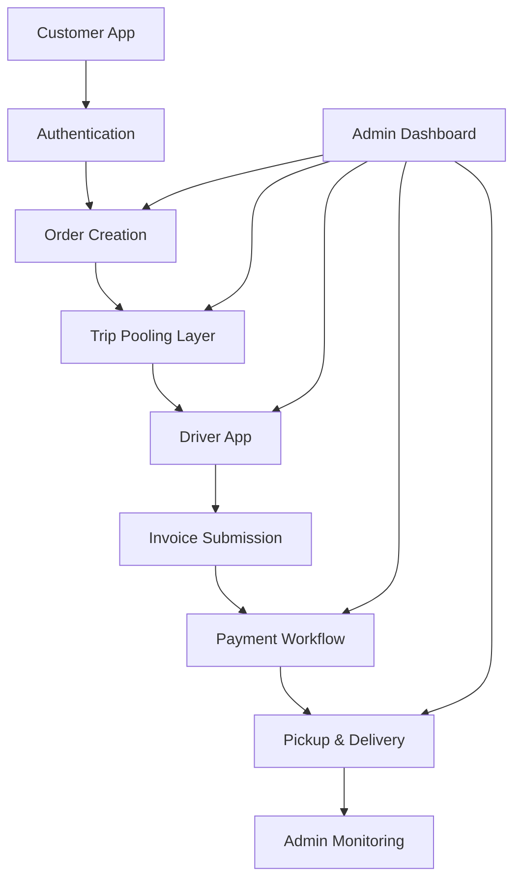
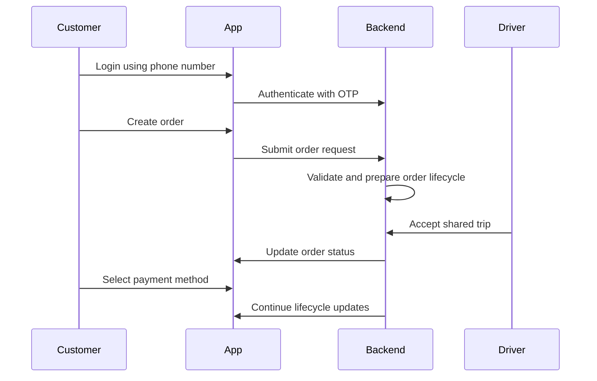
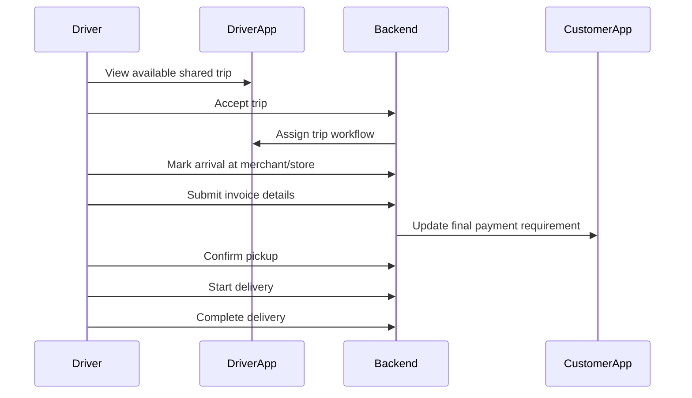
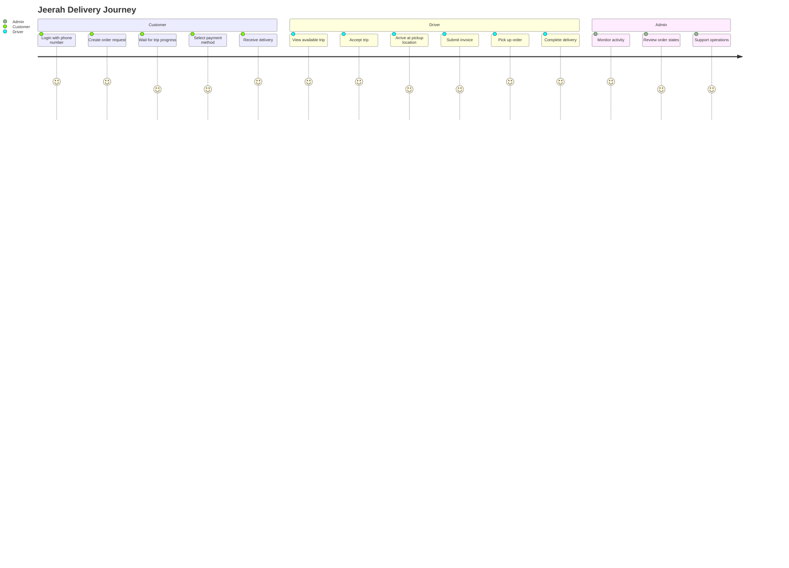
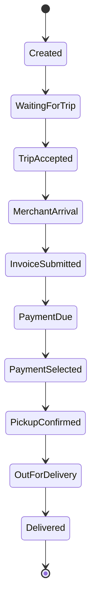
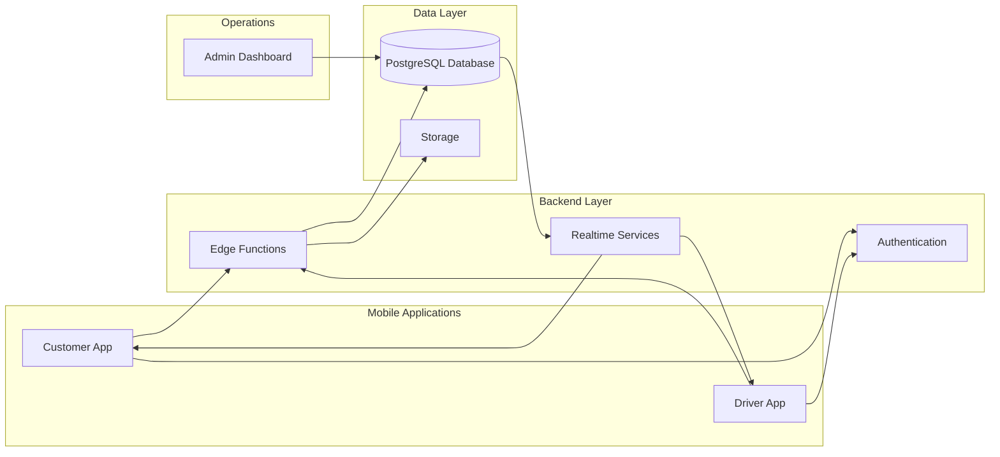

<div align="center">

# Jeerah

### Smart Trip-Pooling Delivery Platform for Remote Communities

*A commercial logistics platform designed to make delivery affordable for customers and profitable for drivers in villages, rural areas, and low-density communities.*

<br />


</div>

---

## Repository Notice

> **This repository is a public showcase for Jeerah.**
>
> Jeerah is a commercial product under active development.  
> The complete source code, backend logic, database schema, Supabase configuration, Edge Functions, RLS policies, payment workflows, deployment assets, pricing logic, and trip-pooling implementation are intentionally kept private to protect the project's intellectual property and commercial viability.
>
> This repository is intended to present the project vision, architecture, engineering approach, product scope, and development progress without exposing sensitive implementation details.

---

## Table of Contents

- [Overview](#overview)
- [Why Jeerah Exists](#why-jeerah-exists)
- [The Problem](#the-problem)
- [The Solution](#the-solution)
- [Product Vision](#product-vision)
- [Core Objectives](#core-objectives)
- [Platform Modules](#platform-modules)
- [Customer Application](#customer-application)
- [Driver Application](#driver-application)
- [Admin Dashboard](#admin-dashboard)
- [Smart Trip-Pooling Concept](#smart-trip-pooling-concept)
- [High-Level User Journey](#high-level-user-journey)
- [Order Lifecycle](#order-lifecycle)
- [System Architecture](#system-architecture)
- [Technology Stack](#technology-stack)
- [Engineering Principles](#engineering-principles)
- [Security Approach](#security-approach)
- [Scalability Approach](#scalability-approach)
- [Development Progress](#development-progress)
- [Roadmap](#roadmap)
- [Screenshots](#screenshots)
- [Suggested Repository Structure](#suggested-repository-structure)
- [What Is Not Included](#what-is-not-included)
- [Commercial Use Notice](#commercial-use-notice)
- [FAQ](#faq)
- [Author](#author)
- [License](#license)

---

## Overview

**Jeerah** is a smart delivery platform built around a specific logistics challenge: providing delivery services in areas where traditional one-order-per-driver models are inefficient, expensive, or economically unsustainable.

Most delivery platforms perform best in dense cities where customers, drivers, restaurants, and stores are close to one another. In remote villages and low-density areas, the same model becomes difficult because each order may require a long trip for a relatively small delivery fee.

Jeerah addresses this by introducing a **smart shared-trip delivery model**.

Instead of handling every order as a separate delivery journey, Jeerah groups compatible customer orders into shared trips. This allows a single driver to serve multiple customers within one structured route, improving the economics of delivery for everyone involved.

The platform is designed to support:

- Customers who need affordable delivery
- Drivers who need profitable trips
- Remote communities with limited logistics coverage
- A scalable commercial delivery operation
- Future regional expansion

---

## Why Jeerah Exists

Delivery access should not be limited to dense urban neighborhoods.

Many villages and remote communities face poor delivery availability because the unit economics are difficult. A driver may need to travel a long distance to serve only one customer, making the delivery fee too high for the customer and not attractive enough for the driver.

Jeerah exists to solve this gap.

The idea is simple:

> Make each driver trip more valuable by combining multiple compatible orders into one organized delivery journey.

This transforms the delivery model from isolated single-order trips into shared, higher-value routes.

---

## The Problem

Remote and underserved delivery markets suffer from several operational challenges:

| Challenge | Impact |
|---|---|
| Long distances | Higher fuel and time cost per order |
| Low order density | Fewer nearby orders to combine manually |
| Limited drivers | Lower availability during peak times |
| Expensive delivery fees | Customers become less likely to order |
| Weak driver incentives | Drivers avoid unprofitable routes |
| Manual coordination | Slower operations and higher error risk |
| Lack of route structure | Inefficient use of driver time |

Traditional delivery platforms are usually optimized for large cities. They rely on density, short travel distances, and high order volume.

Jeerah is designed for a different environment: **distributed communities where logistics must be planned more intelligently.**

---

## The Solution

Jeerah introduces a smart delivery model based on **trip pooling**.

Instead of assigning a separate delivery trip to every order, the platform allows multiple customer orders to be grouped into one shared trip when they are compatible from an operational standpoint.

This creates a more efficient delivery structure:

- Customers pay a more reasonable delivery cost
- Drivers receive more attractive trip earnings
- The platform improves operational efficiency
- Fewer trips are required for the same number of orders
- Delivery becomes more scalable in rural areas

The system is designed to manage the delivery lifecycle from order creation to payment confirmation, driver handling, invoice submission, pickup, and final delivery.

---

## Product Vision

Jeerah aims to become a dedicated logistics platform for remote communities and low-density regions.

The long-term vision is to build a scalable delivery ecosystem that can support:

- Village-to-city ordering
- Local store and restaurant pickups
- Multi-order shared trips
- Flexible payment options
- Driver profitability
- Administrative monitoring
- Future merchant integrations
- Data-driven logistics optimization

The platform is not only a mobile application. It is a complete logistics operating system for communities that are not well served by traditional delivery models.

---

## Core Objectives

The main objectives of Jeerah are:

1. **Reduce delivery cost for customers**
   - Make delivery affordable by sharing trip cost across multiple compatible orders.

2. **Increase driver earnings**
   - Make every trip more valuable by allowing drivers to handle multiple orders within one journey.

3. **Improve delivery availability**
   - Encourage more drivers to accept trips by improving profitability.

4. **Support underserved communities**
   - Focus on areas where traditional delivery platforms struggle.

5. **Build scalable infrastructure**
   - Use modern backend and mobile technologies that can scale with demand.

6. **Protect operational logic**
   - Keep sensitive pricing, pooling, payment, and backend workflows private.

7. **Create a strong commercial foundation**
   - Build a product that can grow into a real operating business.

---

## Platform Modules

Jeerah is composed of multiple connected modules:



### Main Modules

| Module | Purpose |
|---|---|
| Customer App | Allows customers to create and track orders |
| Driver App | Allows drivers to accept trips and manage delivery workflow |
| Admin Dashboard | Supports operational monitoring and management |
| Backend Services | Handles validation, business workflows, and secure operations |
| Database Layer | Stores application data and lifecycle states |
| Authentication | Provides phone-based login |
| Payment Workflow | Supports final payment selection and confirmation |
| Trip Lifecycle | Manages order and trip state transitions |

---

## Customer Application

The customer application is designed to provide a simple order experience while hiding the complexity of shared-trip logistics.

### Key Customer Capabilities

- Phone number login
- OTP-based authentication
- Create delivery requests
- Add order details
- View order status
- Follow trip progress
- Select final payment method
- Support online or cash payment flows
- View order history
- Receive updates during the delivery lifecycle

### Customer Flow



### Customer Experience Goals

The customer experience is designed around:

- Minimal complexity
- Clear delivery status
- Transparent payment steps
- Reliable order progress
- Smooth mobile interface
- Support for rural delivery expectations

---

## Driver Application

The driver application is built around trip execution.

Drivers need a clear workflow that helps them understand what to do next, which orders are included in a trip, and what actions are required at each stage.

### Key Driver Capabilities

- View available trips
- Accept shared delivery trips
- Navigate order workflow
- Mark arrival at pickup location
- Submit merchant invoice amount
- Optionally attach invoice image
- Continue pickup process
- Start delivery
- Complete delivery workflow
- Track trip progress

### Driver Flow



### Driver Experience Goals

The driver application is designed to:

- Reduce confusion during multi-order trips
- Make each trip financially worthwhile
- Provide clear step-by-step actions
- Minimize manual coordination
- Support future earnings and performance views

---

## Admin Dashboard

The admin dashboard supports operational visibility and future business management.

Although the full admin implementation is private, the dashboard is planned to support the operational needs of a commercial logistics platform.

### Dashboard Capabilities

- Monitor active orders
- Monitor active trips
- View customer accounts
- View driver accounts
- Manage operational states
- Review delivery progress
- Track payment-related statuses
- View high-level analytics
- Support customer service operations

### Admin Goals

The admin dashboard is intended to help the operations team:

- Detect delayed orders
- Monitor driver performance
- Review trip progress
- Understand demand patterns
- Manage platform activity
- Support customers and drivers efficiently

---

## Smart Trip-Pooling Concept

The main product concept behind Jeerah is smart trip pooling.

In a traditional model, each order may be treated as a separate delivery task:

```text
Order A → Driver 1 → Customer A
Order B → Driver 2 → Customer B
Order C → Driver 3 → Customer C
```

In Jeerah's shared-trip model, compatible orders can be grouped:

```text
Order A
Order B  → Shared Trip → Driver → Multiple Customers
Order C
```

This improves the economic efficiency of delivery in low-density regions.

### Benefits

| Stakeholder | Benefit |
|---|---|
| Customer | Lower delivery cost |
| Driver | Higher trip value |
| Platform | Better operational efficiency |
| Community | Improved delivery availability |

### What Makes It Valuable

Trip pooling is especially valuable when:

- Customers are located in the same general area
- Pickup locations are compatible
- Delivery windows are reasonable
- Driver capacity is sufficient
- Trip cost can be shared fairly

> Note: The actual pooling rules, matching criteria, pricing logic, and optimization methods are proprietary and are not published in this repository.

---

## High-Level User Journey



---

## Order Lifecycle

The platform uses a structured lifecycle for orders and trips.

A simplified public version of the lifecycle is shown below:



This diagram is intentionally simplified. Internal states, validations, payment rules, and exception paths are not included.

---

## System Architecture

Jeerah follows a cloud-backed mobile architecture.



### Architecture Goals

- Separate customer, driver, and admin concerns
- Keep business logic server-side where necessary
- Use secure authentication flows
- Maintain clean state transitions
- Support future scaling
- Protect sensitive commercial logic
- Enable real-time delivery updates

---

## Technology Stack

### Mobile

| Technology | Usage |
|---|---|
| Flutter | Cross-platform mobile application development |
| Dart | Main mobile application language |

### Backend

| Technology | Usage |
|---|---|
| Supabase | Backend platform and managed services |
| Edge Functions | Server-side workflows and secure operations |
| TypeScript | Backend function development |
| Deno | Runtime for Edge Functions |

### Database

| Technology | Usage |
|---|---|
| PostgreSQL | Relational database |
| Row Level Security | Database-level access control |
| Realtime | Delivery status updates |

### Product & Development

| Tool | Usage |
|---|---|
| Git | Version control |
| GitHub | Repository and project showcase |
| Figma | Interface design and prototyping |

---

## Engineering Principles

Jeerah is built around the following engineering principles:

### 1. Mobile-First Design

The platform is designed primarily for mobile users. Customers and drivers interact with the system through mobile-first workflows that prioritize clarity and speed.

### 2. Secure by Design

Sensitive operations are handled through secure backend workflows. Public clients should not directly control critical business logic.

### 3. State-Driven Workflows

Orders and trips follow structured state transitions. This reduces ambiguity and helps keep customer, driver, and admin views synchronized.

### 4. Commercial Logic Protection

The platform intentionally separates public showcase documentation from private implementation logic.

### 5. Operational Scalability

The system is designed to support future expansion, additional regions, more drivers, higher order volume, and advanced admin tools.

### 6. Maintainable Architecture

The application is structured to support iterative development, testing, and progressive feature delivery.

---

## Security Approach

Security is a core part of Jeerah's architecture.

Publicly shareable security concepts include:

- Phone OTP authentication
- JWT-based authenticated access
- Server-side validation
- Database access control
- Role-aware workflows
- Secure storage practices
- Principle of least privilege
- Separation between public clients and privileged operations

The following details are intentionally not published:

- Database schema
- Row Level Security policies
- Backend function implementation
- Payment logic
- Authentication configuration
- Production environment variables
- Supabase project configuration
- Deployment credentials

For more details, see [`SECURITY.md`](SECURITY.md).

---

## Scalability Approach

Jeerah is designed with future growth in mind.

The system is structured to support:

- More customers
- More drivers
- More geographic areas
- More shared trips
- Increased order volume
- More administrative tools
- More analytics capabilities
- Future merchant integrations

### Scalability Focus Areas

| Area | Approach |
|---|---|
| Mobile | Cross-platform Flutter foundation |
| Backend | Server-side workflows with Edge Functions |
| Database | Relational modeling with PostgreSQL |
| Operations | Admin dashboard and monitoring workflows |
| Delivery | Structured trip and order lifecycle |
| Expansion | Modular product design |

---

## Development Progress

Jeerah is currently under active development.

### Completed Foundation

- Mobile application foundation
- Supabase backend setup
- Phone OTP authentication
- Database foundation
- Driver trip workflow
- Driver invoice submission workflow
- Customer final payment selection
- Order lifecycle foundation
- Shared trip lifecycle foundation
- Admin foundation

### Current Focus

- Delivery completion workflow
- Final trip closing
- Driver earnings logic
- Admin visibility improvements
- Notification foundation
- QA and workflow testing

### Upcoming Focus

- Production hardening
- Better analytics
- Improved admin tooling
- Notification expansion
- UX polish
- Beta launch preparation

---

## Roadmap

### Phase 1 — Foundation

- [x] Define product concept
- [x] Build initial architecture
- [x] Set up Supabase backend
- [x] Build database foundation
- [x] Implement phone OTP authentication
- [x] Create customer and driver foundations

### Phase 2 — Driver Workflow

- [x] Shared trip acceptance
- [x] Merchant arrival action
- [x] Invoice submission
- [x] Optional invoice image support
- [x] Pickup workflow foundation

### Phase 3 — Customer Payment Workflow

- [x] Final payment selection
- [x] Payment state handling
- [x] Price lock concept
- [x] Trip progression after payment

### Phase 4 — Delivery Completion

- [ ] Complete delivery lifecycle
- [ ] Confirm delivery completion
- [ ] Close trip state
- [ ] Finalize driver earnings
- [ ] Improve admin monitoring

### Phase 5 — Operations & Launch Readiness

- [ ] Push notifications
- [ ] Dashboard analytics
- [ ] Error handling improvements
- [ ] Security review
- [ ] Performance testing
- [ ] Beta launch preparation

---

## Screenshots

Screenshots and product visuals will be added once the public showcase assets are prepared.

Planned visual sections:

- Customer App screens
- Driver App screens
- Admin Dashboard previews
- Order lifecycle diagrams
- Trip-pooling visual explanation
- Product architecture diagram

> Sensitive data, internal IDs, customer information, driver information, payment details, and production environment data will not be shown in public screenshots.

---

## Suggested Repository Structure

This showcase repository can be organized as follows:

```text
jeerah-showcase/
├── README.md
├── FEATURES.md
├── ARCHITECTURE.md
├── SYSTEM_DESIGN.md
├── ROADMAP.md
├── SECURITY.md
├── FAQ.md
├── CHANGELOG.md
├── LICENSE.md
├── NOTICE.md
│
├── docs/
│   ├── screenshots.md
│   ├── user-flows.md
│   ├── tech-stack.md
│   ├── development-progress.md
│   ├── architecture-decisions.md
│   └── commercial-notice.md
│
└── assets/
    ├── banner.png
    ├── logo.png
    ├── customer-app/
    ├── driver-app/
    ├── admin-dashboard/
    └── diagrams/
```

---

## What Is Not Included

This repository does **not** include:

- Production source code
- Flutter application source files
- Supabase project configuration
- Supabase Edge Functions
- Database migrations
- Database schema
- RLS policies
- Payment implementation
- Trip-pooling algorithm
- Pricing logic
- Driver earnings formula
- Admin dashboard source code
- Production deployment files
- Environment variables
- API keys
- Customer data
- Driver data
- Internal business rules

This is intentional.

Jeerah is a commercial product, and the above components are private intellectual property.

---

## Commercial Use Notice

Jeerah is not open source.

This public repository is provided for:

- Portfolio presentation
- Technical showcase
- Product explanation
- Interview discussion
- High-level architecture review

It is not provided for:

- Running the application
- Reusing the business model
- Copying implementation details
- Commercial replication
- Reverse engineering
- Public redistribution

Any commercial use, copying, reproduction, modification, or redistribution requires prior written permission from the owner.

---

## FAQ

### Is Jeerah open source?

No. Jeerah is a private commercial product. This repository is only a public showcase.

### Can I run the project locally?

No. The executable source code, backend configuration, and database schema are not included.

### Why is the source code private?

Because Jeerah is under active commercial development and includes proprietary business logic, delivery workflows, pricing logic, payment handling, and trip-pooling implementation.

### Can recruiters or hiring managers discuss the technical details?

Yes. High-level architecture, engineering decisions, technology choices, and development process can be discussed during interviews without exposing private implementation details.

### Does this repository represent a real project?

Yes. Jeerah is an active commercial software project built around a real logistics problem.

---

## Author

**Abdullah Asiri**

- Information Technology graduate
- Cybersecurity track
- Flutter and backend developer
- Builder of commercial software products
- Interested in logistics technology, automation, cybersecurity, and scalable mobile systems

---

## License

Copyright © 2026 Abdullah Asiri.

All rights reserved.

This repository is provided for portfolio and demonstration purposes only.

No part of Jeerah may be copied, modified, redistributed, reverse engineered, or used commercially without prior written permission.

For full license details, see [`LICENSE.md`](LICENSE.md).

---

<div align="center">

### Jeerah

**Making delivery smarter, more affordable, and more viable for remote communities.**

</div>
