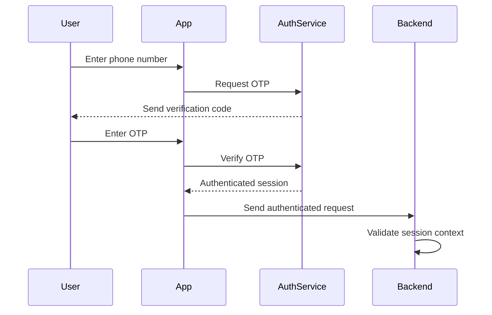
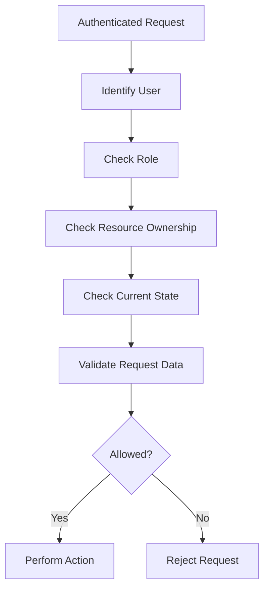
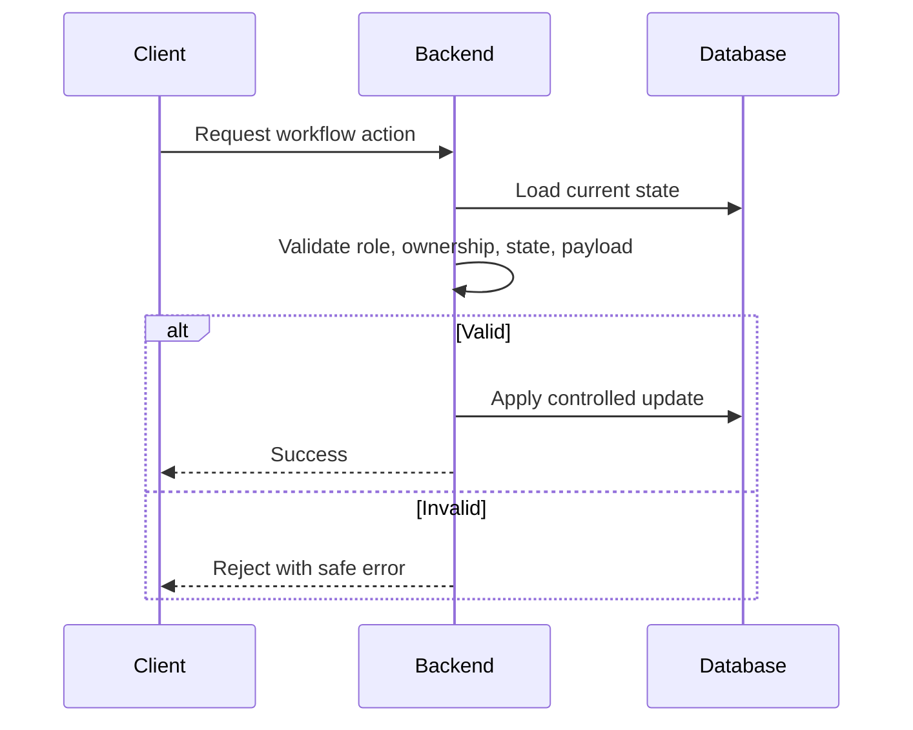

# Jeerah Security

> Public security documentation for **Jeerah**, a commercial smart trip-pooling delivery platform.

---

## Repository Notice

This file is part of the public showcase repository for Jeerah. It describes the security approach at a high level only and does not disclose private source code, Supabase configuration, database schema, Row Level Security policies, Edge Functions, payment implementation, environment variables, API keys, admin permission rules, or proprietary business logic.

Jeerah is a commercial product under active development. This document is intended to communicate security awareness without exposing sensitive implementation details.

---

## Table of Contents

- [Security Overview](#security-overview)
- [Security Goals](#security-goals)
- [Authentication](#authentication)
- [Authorization](#authorization)
- [Role Separation](#role-separation)
- [Backend Validation](#backend-validation)
- [Database Security](#database-security)
- [Storage Security](#storage-security)
- [Payment Security](#payment-security)
- [Environment Secrets](#environment-secrets)
- [Client-Side Security](#client-side-security)
- [Admin Security](#admin-security)
- [Operational Security](#operational-security)
- [Data Privacy](#data-privacy)
- [Threat Model](#threat-model)
- [Responsible Disclosure](#responsible-disclosure)
- [Security Roadmap](#security-roadmap)
- [Public Repository Checklist](#public-repository-checklist)
- [Summary](#summary)

---

## Security Overview

Security is a core part of Jeerah's architecture because the platform handles customers, drivers, orders, trips, invoices, payment state, and administrative monitoring.

The platform follows a security model based on:

- Authenticated access.
- Role-aware workflows.
- Backend-controlled validation.
- Database-level access restrictions.
- Private environment configuration.
- Secure storage practices.
- Limited data exposure.
- Commercial logic protection.

---

## Security Goals

| Goal | Description |
|---|---|
| Protect user data | Customers and drivers should only access data relevant to them |
| Protect business logic | Pricing, pooling, and payment logic must remain private |
| Prevent invalid actions | Users should not be able to skip workflow steps |
| Secure payment flow | Payment-related logic must be handled carefully |
| Secure admin access | Admin tools must not be publicly exposed |
| Protect production secrets | API keys and environment variables must never be committed |
| Support future audits | Important actions should be traceable in future versions |
| Maintain trust | Customers and drivers should have a reliable and safe experience |

---

## Authentication

Jeerah uses phone-based authentication as the primary user access method.



### Authentication Goals

- Reduce onboarding friction.
- Tie actions to verified phone identities.
- Support mobile-first access.
- Provide authenticated session context.
- Enable role-aware workflows.
- Prevent anonymous access to protected operations.

### Authentication Non-Disclosure

This repository does not include:

- Auth provider configuration.
- OTP provider secrets.
- Token handling implementation.
- Session storage implementation.
- Production authentication settings.

---

## Authorization

Authorization determines whether an authenticated user can perform a specific action.

Authentication answers: **Who is this user?**

Authorization answers: **What is this user allowed to do?**

### Authorization Checks

Important actions may require:

| Check | Purpose |
|---|---|
| User is authenticated | Prevent anonymous access |
| User has correct role | Customer, driver, and admin actions differ |
| User owns the resource | Customers should access their own orders |
| Driver is assigned | Drivers should access assigned/accepted trips |
| Current state is valid | Prevent invalid lifecycle transitions |
| Payload is valid | Prevent malformed or unsafe input |
| Backend approval | Sensitive actions require server-side validation |



---

## Role Separation

| Role | Main Access |
|---|---|
| Customer | Own orders and payment actions |
| Driver | Available and assigned trip workflows |
| Admin | Operational monitoring and management |
| Backend | Secure validation and controlled state updates |

### Role Separation Principles

- Customers should not access other customers' orders.
- Customers should not access private driver data.
- Drivers should not access unrelated orders.
- Drivers should not access admin-only views.
- Admin access should be restricted and auditable.
- Sensitive workflows should be validated by the backend.
- Public clients should not own commercial decision logic.

---

## Backend Validation

Backend validation is one of Jeerah's most important security controls. Client applications are responsible for user experience; the backend is responsible for trust.

### Backend Validation Areas

| Area | Validation Purpose |
|---|---|
| Order creation | Ensure required data exists and belongs to the user |
| Trip acceptance | Ensure trip is available and driver is allowed |
| Merchant arrival | Ensure driver is assigned and state is valid |
| Invoice submission | Ensure invoice belongs to valid order/trip context |
| Payment selection | Ensure payment is due and action is allowed |
| Pickup confirmation | Ensure preconditions are satisfied |
| Delivery completion | Ensure delivery can be completed |
| Admin action | Ensure admin has permission |



---

## Database Security

Jeerah uses a relational database foundation that must protect customer, driver, order, trip, payment, and operational records.

### Database Security Principles

- Restrict direct access to sensitive records.
- Enforce role-aware reads and writes.
- Prevent users from editing lifecycle states directly.
- Protect admin-only data.
- Avoid exposing database schema publicly.
- Keep migrations private.
- Keep policies private.
- Validate important writes through backend workflows.

### Database Non-Disclosure

This repository does not publish table names, column names, SQL migrations, RLS policies, database functions, triggers, views, indexing strategy, production connection strings, or internal enum values.

---

## Storage Security

Jeerah may use storage for operational files such as invoice images.

| Principle | Description |
|---|---|
| Controlled uploads | Uploads must be tied to valid workflow actions |
| File ownership | Files should be associated with the correct order/trip |
| Access restrictions | Files should only be accessible to authorized users |
| No public leakage | Sensitive operational files should not be publicly exposed |
| Admin review | Future admin tools may review uploaded files safely |
| Safe metadata | File references should avoid leaking unnecessary data |

---

## Payment Security

Payment-related workflows require careful handling because they affect order progression and financial state.

### Payment Security Principles

- Payment logic should not be controlled only by the client.
- Payment state transitions should be validated.
- Final amount logic should remain server-side or protected.
- Payment provider secrets must never be committed.
- Payment callbacks/webhooks must be verified.
- Payment status should be reflected consistently in order state.
- Online and cash payment paths should be clearly separated.

### Payment Non-Disclosure

This repository does not publish payment provider configuration, API keys, webhook secrets, verification logic, refund logic, reconciliation logic, transaction schema, pricing formulas, or delivery fee rules.

---

## Environment Secrets

Production secrets must never be committed to a public repository.

Examples of secrets not included:

```text
.env
.env.local
.env.production
SUPABASE_URL
SUPABASE_ANON_KEY
SUPABASE_SERVICE_ROLE_KEY
PAYMENT_API_KEY
WEBHOOK_SECRET
DATABASE_URL
JWT_SECRET
OTP_PROVIDER_SECRET
STORAGE_SECRET
ADMIN_SECRET
```

### Secret Handling Principles

- Keep environment variables outside Git.
- Use environment-specific configuration.
- Do not publish production keys.
- Rotate secrets if exposed.
- Use separate development and production environments.
- Avoid hardcoding credentials in source code.
- Never include service-role keys in client apps.

---

## Client-Side Security

Mobile clients are not trusted with sensitive business logic.

The customer and driver apps should display data, collect user input, call backend workflows, show status updates, and handle user experience.

They should not calculate sensitive prices, decide trip compatibility, validate payment completion alone, modify protected lifecycle states directly, access unrelated user data, contain production secrets, or expose admin capabilities.

---

## Admin Security

Admin functionality is highly sensitive.

| Requirement | Description |
|---|---|
| Restricted access | Only authorized admins should access dashboard |
| Role-based permissions | Admin actions should depend on permission level |
| Safe actions | Admin operations should use controlled backend workflows |
| Auditability | Future versions should log admin actions |
| Minimal exposure | Admin dashboard should not expose unnecessary secrets |
| Session security | Admin sessions should be protected |

---

## Operational Security

| Concern | Mitigation Direction |
|---|---|
| Stuck orders | Admin monitoring and exception handling |
| Invalid driver actions | Backend state validation |
| Payment mismatch | Controlled payment state workflow |
| Invoice abuse | Validation and future review workflows |
| Account misuse | Authentication and role separation |
| Data leakage | Restricted access and minimal exposure |
| Production errors | Logging and monitoring roadmap |

---

## Data Privacy

Jeerah handles user and operational data. Privacy must be considered throughout development.

### Privacy Principles

- Collect only necessary data.
- Show users only the data they need.
- Avoid exposing sensitive customer details publicly.
- Protect driver operational data.
- Protect invoice and payment-related data.
- Avoid storing secrets in logs.
- Remove or mask sensitive data in screenshots.
- Do not publish real user data in showcase materials.

---

## Threat Model

| Threat | Description | Mitigation Direction |
|---|---|---|
| Unauthorized order access | User attempts to view another customer's order | Role and ownership checks |
| Unauthorized trip access | Driver attempts to access unrelated trips | Driver assignment validation |
| Invalid state transition | User tries to skip workflow stages | Backend state validation |
| Payment manipulation | Client attempts to modify amount or payment state | Server-side payment validation |
| Invoice manipulation | Invalid or unauthorized invoice submission | Driver/trip/order validation |
| Secret leakage | Credentials committed to GitHub | Strict secret exclusion |
| Admin abuse | Unauthorized admin actions | Role-based admin permissions |
| Data exposure in screenshots | Real data shown publicly | Masked/demo data only |

---

## Responsible Disclosure

Jeerah is currently a private commercial project.

If you discover a potential security issue in public materials related to this showcase repository, please report it privately to the project owner.

Do not publicly disclose suspected vulnerabilities, private implementation assumptions, or sensitive findings.

---

## Security Roadmap

### Completed

- Phone OTP authentication foundation.
- Authenticated session foundation.
- Role-aware workflow foundation.
- Backend validation pattern.
- Private source code repository.
- Public showcase separation.
- Secret exclusion from public files.

### In Progress

- Stronger workflow validation.
- Delivery completion validation.
- Admin monitoring foundation.
- Payment workflow hardening.
- Error handling improvements.

### Planned

- Full security review.
- Production environment separation.
- Audit logging.
- Admin action logging.
- Monitoring and alerting.
- Rate limiting.
- Backup strategy.
- Incident response checklist.
- Vulnerability review before beta launch.

---

## Public Repository Checklist

Before publishing any file publicly, verify that it does not contain:

- [ ] API keys
- [ ] Supabase service role key
- [ ] Payment provider keys
- [ ] Database connection string
- [ ] Real customer data
- [ ] Real driver data
- [ ] Real phone numbers
- [ ] Production URLs
- [ ] Internal table names if sensitive
- [ ] SQL migrations
- [ ] RLS policies
- [ ] Edge Function source code
- [ ] Pricing formulas
- [ ] Driver earnings formula
- [ ] Trip-pooling algorithm
- [ ] Admin credentials
- [ ] Production logs
- [ ] Error stack traces with secrets

---

## Summary

Jeerah's security design is based on the principle that public clients should not own sensitive business logic.

The system depends on authenticated users, role separation, backend validation, database access control, secure storage boundaries, protected payment workflows, private environment configuration, and public/private repository separation.

---

## Related Documents

- [`README.md`](README.md)
- [`FEATURES.md`](FEATURES.md)
- [`ARCHITECTURE.md`](ARCHITECTURE.md)
- [`SYSTEM_DESIGN.md`](SYSTEM_DESIGN.md)
- [`ROADMAP.md`](ROADMAP.md)
- [`FAQ.md`](FAQ.md)
- [`NOTICE.md`](NOTICE.md)
- [`LICENSE.md`](LICENSE.md)

---

<div align="center">

**Jeerah Security**

*Secure by design. Private where it matters.*

</div>
