# Jeerah System Design

> Public system design documentation for **Jeerah**, a smart trip-pooling delivery platform for remote communities.

---

## Repository Notice

This document is part of the public showcase repository for Jeerah.

It explains Jeerah's system design at a high level only. It does **not** disclose production source code, private database schema, Supabase configuration, Edge Functions, Row Level Security policies, pricing logic, payment provider implementation, trip-pooling algorithm, driver earnings rules, deployment secrets, or proprietary business workflows.

Jeerah is a commercial product under active development. This document is intended for portfolio, interview, architecture review, and product showcase purposes.

---

## Table of Contents

- [System Design Overview](#system-design-overview)
- [Design Context](#design-context)
- [System Goals](#system-goals)
- [Non-Goals](#non-goals)
- [Core Actors](#core-actors)
- [System Boundaries](#system-boundaries)
- [Domain Model](#domain-model)
- [High-Level Component Design](#high-level-component-design)
- [Application Design](#application-design)
- [Backend Design](#backend-design)
- [Database Design Principles](#database-design-principles)
- [State Machine Design](#state-machine-design)
- [Order State Design](#order-state-design)
- [Trip State Design](#trip-state-design)
- [Customer Workflow Design](#customer-workflow-design)
- [Driver Workflow Design](#driver-workflow-design)
- [Admin Workflow Design](#admin-workflow-design)
- [Trip-Pooling Design Concept](#trip-pooling-design-concept)
- [Invoice System Design](#invoice-system-design)
- [Payment System Design](#payment-system-design)
- [Realtime Update Design](#realtime-update-design)
- [Notification Design](#notification-design)
- [Security Design](#security-design)
- [Authorization Design](#authorization-design)
- [Error Handling Design](#error-handling-design)
- [Data Consistency Design](#data-consistency-design)
- [Scalability Design](#scalability-design)
- [Reliability Design](#reliability-design)
- [Observability Design](#observability-design)
- [Performance Considerations](#performance-considerations)
- [Admin Operations Design](#admin-operations-design)
- [Public Design Diagrams](#public-design-diagrams)
- [Sensitive Design Areas](#sensitive-design-areas)
- [Future Design Improvements](#future-design-improvements)
- [Summary](#summary)
- [Related Documents](#related-documents)

---

# System Design Overview

Jeerah is designed as a multi-actor delivery platform where customers, drivers, and administrators interact with a shared backend system.

The system is built around structured workflows rather than isolated screens.

At the center of the platform are two core lifecycle entities:

1. **Order**
2. **Trip**

An order represents a customer delivery request.

A trip represents a driver execution journey that may contain one or more orders.

This distinction is important because Jeerah is not designed as a simple one-order-one-driver platform. The product is based on a shared-trip model where multiple orders can be handled within a single driver trip.

---

## Design Context

Traditional delivery platforms work well when:

- Customers are close together
- Drivers are abundant
- Pickup locations are nearby
- Delivery distances are short
- Order volume is high

Jeerah is designed for a different operating environment:

- Villages
- Remote areas
- Low-density communities
- Longer driving distances
- Lower order density
- Fewer available drivers
- Higher cost per trip

Because of this, the system design must support shared trips, flexible payment timing, driver invoice submission, and clear state progression.

---

## System Goals

The system design supports the following goals:

| Goal | Description |
|---|---|
| Affordable delivery | Reduce the delivery cost burden on individual customers |
| Profitable driver trips | Make trips attractive enough for drivers |
| Controlled workflows | Prevent invalid order and trip state transitions |
| Secure backend logic | Keep critical decisions away from public clients |
| Scalable operations | Support growth in users, orders, trips, and regions |
| Operational visibility | Enable admin monitoring and future analytics |
| Mobile-first experience | Prioritize simple customer and driver flows |
| Commercial protection | Keep proprietary logic private |

---

## Non-Goals

This public system design intentionally does not aim to:

- Reveal the actual source code
- Reveal the production database schema
- Reveal the trip-pooling algorithm
- Reveal pricing formulas
- Reveal delivery fee logic
- Reveal driver earnings calculations
- Reveal payment provider implementation
- Reveal admin permission rules
- Reveal Supabase project configuration
- Reveal Row Level Security policies
- Reveal deployment infrastructure secrets

This document explains the design direction, not the private implementation.

---

# Core Actors

Jeerah is designed around four primary actor categories.

---

## 1. Customer

The customer creates delivery requests and receives the order.

### Customer Responsibilities

- Sign in using phone number
- Create an order
- Provide order details
- Monitor order progress
- Select final payment method
- Receive delivery

### Customer Design Requirements

- Simple mobile interface
- Minimal operational complexity
- Clear order status
- Clear payment step
- Reliable updates
- No exposure to internal pooling logic

---

## 2. Driver

The driver accepts and executes shared trips.

### Driver Responsibilities

- Sign in
- View available shared trips
- Accept a trip
- Arrive at pickup location
- Submit invoice amount
- Pick up orders
- Start delivery
- Complete delivery

### Driver Design Requirements

- Clear trip workflow
- Clear order list inside trip
- Simple invoice submission
- Action-based interface
- Reduced ambiguity
- Reliable state updates

---

## 3. Admin

The admin monitors and manages operations.

### Admin Responsibilities

- View active orders
- View active trips
- Monitor driver activity
- Inspect operational states
- Support customer or driver issues
- Review platform health
- Manage future configuration

### Admin Design Requirements

- Operational visibility
- Reliable data views
- Support tooling
- Role-based access
- Future analytics
- Manual exception handling

---

## 4. Backend System

The backend system controls secure workflows.

### Backend Responsibilities

- Validate authenticated users
- Enforce allowed state transitions
- Protect sensitive logic
- Coordinate order and trip changes
- Handle invoice workflow
- Handle payment state workflow
- Support realtime updates
- Support admin monitoring

---

# System Boundaries

Jeerah's system boundaries define what each major layer is allowed to do.

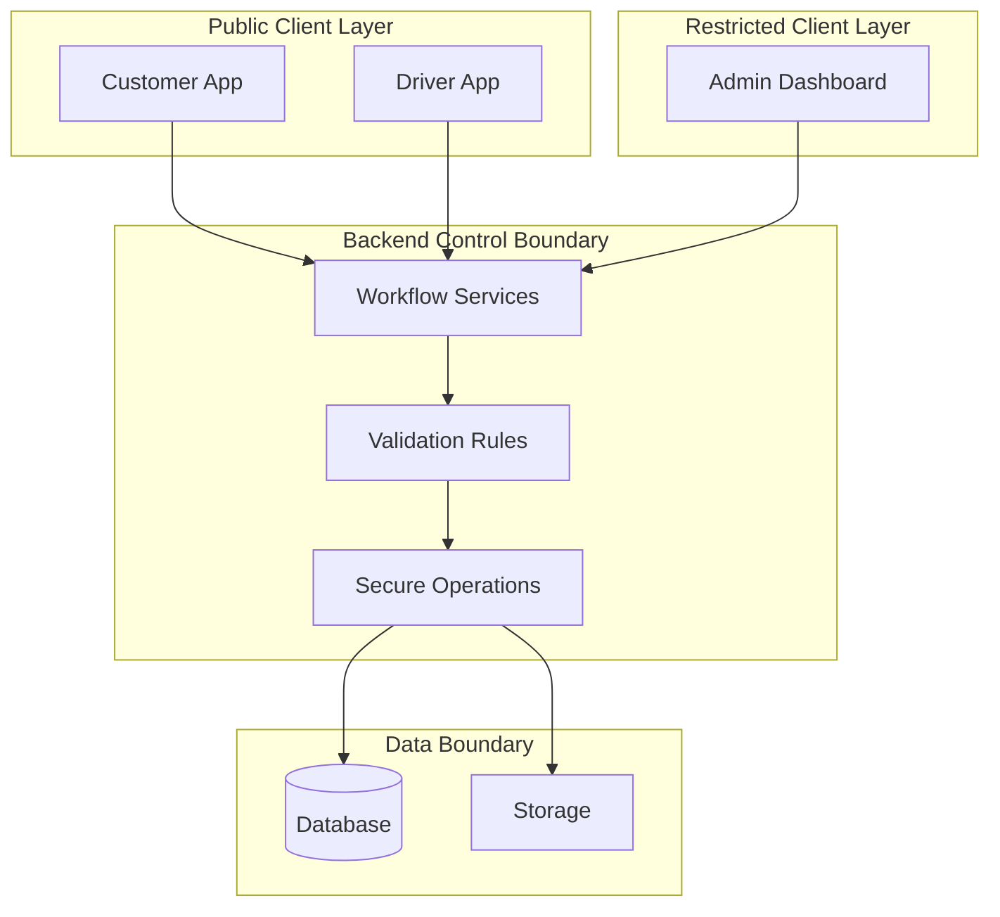

## Boundary Rules

| Boundary | Rule |
|---|---|
| Customer App | Can request customer actions only |
| Driver App | Can request driver actions only |
| Admin Dashboard | Can request admin-level operational actions |
| Backend | Decides whether actions are allowed |
| Database | Stores state but does not expose unrestricted access |
| Storage | Stores operational files with controlled access |

---

# Domain Model

The public domain model is intentionally simplified.

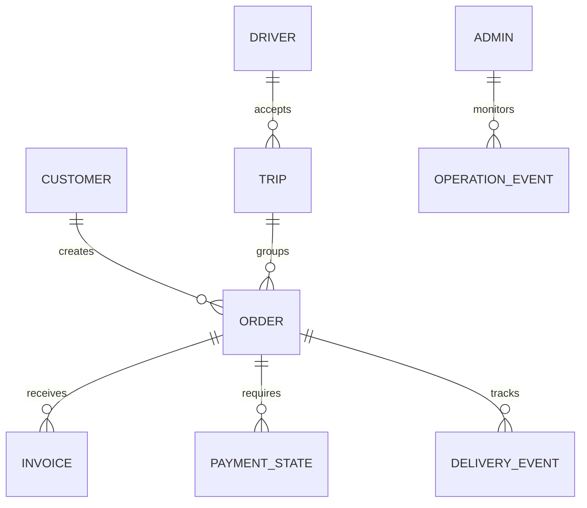

## Main Domain Concepts

| Concept | Public Description |
|---|---|
| Customer | A user who creates delivery requests |
| Driver | A user who accepts and executes shared trips |
| Order | A delivery request created by a customer |
| Trip | A driver journey that may contain multiple orders |
| Invoice | Merchant/store purchase information submitted by driver |
| Payment State | Represents where the order is in the payment flow |
| Delivery Event | Tracks meaningful delivery lifecycle updates |
| Admin Operation | Admin-side monitoring or support action |

## Private Domain Details

The following are private:

- Actual table names
- Actual columns
- Foreign key structure
- Indexing strategy
- SQL functions
- Database triggers
- RLS policies
- Internal enum names
- Migration files

---

# High-Level Component Design

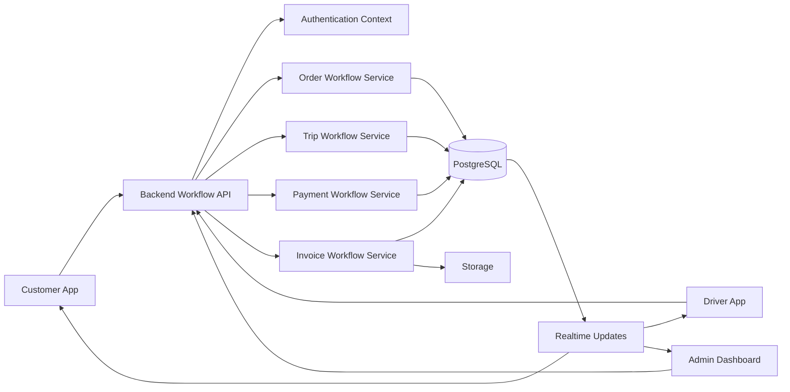

## Component Summary

| Component | Responsibility |
|---|---|
| Customer App | Customer-facing order and payment experience |
| Driver App | Driver-facing trip and delivery execution |
| Admin Dashboard | Operational monitoring and management |
| Workflow API | Controlled entry point for sensitive operations |
| Authentication Context | Identifies user and role |
| Order Workflow Service | Manages order lifecycle actions |
| Trip Workflow Service | Manages trip lifecycle actions |
| Payment Workflow Service | Manages payment state actions |
| Invoice Workflow Service | Manages invoice submission actions |
| Database | Stores persistent system state |
| Storage | Stores optional operational files |
| Realtime Updates | Pushes state changes to relevant clients |

---

# Application Design

Jeerah's client applications follow a role-specific design.

Each application displays only the workflows needed by that user type.

---

## Customer App Design

The customer app focuses on:

- Order creation
- Order tracking
- Final payment selection
- Delivery progress

### Customer App Screen Groups

```text
Authentication
├── Phone Entry
└── OTP Verification

Customer Home
├── Create Order
├── Active Order
├── Order Status
├── Payment Selection
└── Order History
```

### Customer App Design Principles

- Keep order creation simple
- Hide operational complexity
- Use clear state labels
- Display only relevant actions
- Avoid showing internal driver/admin data
- Make payment steps obvious
- Keep the interface mobile-first

---

## Driver App Design

The driver app focuses on:

- Available trips
- Trip execution
- Invoice submission
- Pickup and delivery workflow

### Driver App Screen Groups

```text
Authentication
├── Phone Entry
└── OTP Verification

Driver Home
├── Available Trips
├── Active Trip
├── Order Cards
├── Merchant Arrival
├── Invoice Submission
├── Pickup Confirmation
├── Delivery Progress
└── Trip Completion
```

### Driver App Design Principles

- Show clear next action
- Reduce decision fatigue
- Support multi-order trips
- Keep invoice input fast
- Provide strong workflow feedback
- Prevent invalid driver actions
- Support future earnings visibility

---

## Admin Dashboard Design

The admin dashboard focuses on:

- Operational monitoring
- Support workflows
- Platform visibility
- Future analytics

### Admin Dashboard Screen Groups

```text
Admin Dashboard
├── Overview
├── Orders
├── Trips
├── Drivers
├── Customers
├── Payment States
├── Support / Exceptions
├── Analytics
└── Configuration
```

### Admin Design Principles

- Prioritize operational clarity
- Surface exceptions quickly
- Provide searchable data views
- Allow safe admin actions
- Keep sensitive controls role-protected
- Prepare for future analytics

---

# Backend Design

The backend is responsible for controlling sensitive business workflows.

In Jeerah, clients should not directly decide whether important state transitions are valid. Instead, the backend validates each action using authentication context, current state, and business rules.

---

## Backend Design Pattern

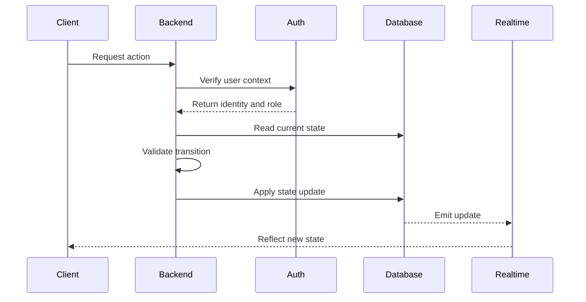

---

## Backend Responsibilities

| Responsibility | Description |
|---|---|
| Authentication verification | Ensure the actor is authenticated |
| Role validation | Ensure the actor is allowed to perform the action |
| State validation | Ensure the current lifecycle state allows the action |
| Data validation | Validate submitted payloads |
| State updates | Apply controlled changes to orders and trips |
| Payment workflow support | Handle payment-related state progression |
| Invoice workflow support | Handle invoice-related updates |
| Realtime support | Trigger or enable relevant updates |
| Admin support | Provide data for operational views |

---

## Backend Non-Responsibilities

The backend should not:

- Expose internal formulas publicly
- Return private business rules to clients
- Trust sensitive client-side calculations
- Allow unrestricted table access
- Allow users to update lifecycle states arbitrarily
- Leak driver/customer data beyond necessary operational needs

---

# Database Design Principles

The actual database schema is private. This section explains only the public design principles.

---

## Database Goals

| Goal | Description |
|---|---|
| Relational integrity | Keep relationships between users, orders, trips, invoices, and payment states consistent |
| Lifecycle tracking | Store current and historical state information |
| Secure access | Restrict reads and writes based on authenticated context |
| Operational visibility | Enable admin monitoring |
| Future analytics | Support reporting and performance insights |
| Maintainability | Allow schema evolution during active development |

---

## Public Data Grouping

```text
Data Layer
├── Identity Data
├── Customer Data
├── Driver Data
├── Order Data
├── Trip Data
├── Invoice Data
├── Payment State Data
├── Delivery Event Data
├── Admin / Operations Data
└── Analytics-Ready Data
```

## Database Design Considerations

- Use structured lifecycle fields
- Keep role-specific data access separated
- Support one-to-many relationships between trips and orders
- Support invoice records per order
- Support payment state progression
- Support delivery event history
- Support admin filtering and monitoring
- Prepare for indexing as data grows

---

# State Machine Design

Jeerah is state-driven.

A state machine approach makes the platform easier to reason about because each entity can only move through valid states.

---

## Why State Machines Matter

Delivery workflows can become messy if each screen directly updates data without rules.

A state-driven design helps prevent:

- Drivers picking up orders before invoice submission
- Customers paying before final amount exists
- Trips being completed before delivery starts
- Orders appearing in inconsistent states
- Admin views showing contradictory data
- Payment workflow mismatches

---

## State Transition Design Pattern

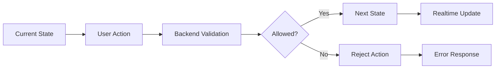

---

## State Transition Rules

Every important transition should consider:

| Check | Purpose |
|---|---|
| Actor identity | Who is trying to perform the action? |
| Actor role | Is this a customer, driver, or admin? |
| Current state | Is the entity currently in the expected state? |
| Ownership | Does the actor own or participate in this entity? |
| Required data | Are required fields present? |
| Business rule | Is the transition allowed by product rules? |
| Side effects | Should related entities update too? |

---

# Order State Design

Orders are the customer-facing delivery request.

---

## Simplified Public Order State Machine

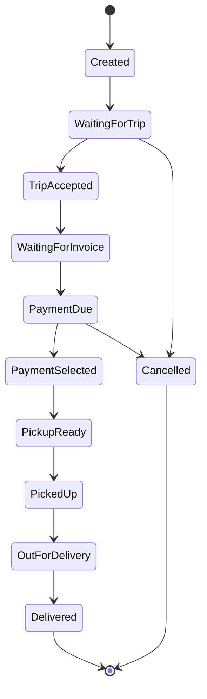

## Order State Design Goals

| Goal | Description |
|---|---|
| Clear customer progress | Customer always sees a meaningful state |
| Driver coordination | Driver workflow updates order state |
| Payment coordination | Payment state aligns with order state |
| Admin monitoring | Admin can understand where orders are stuck |
| Exception handling | Cancelled or failed states can be supported |
| Future analytics | State durations can be measured later |

---

## Example Order State Responsibilities

| State | Meaning |
|---|---|
| Created | Order has been created |
| WaitingForTrip | Order is waiting to be included in a trip |
| TripAccepted | A driver has accepted the related trip |
| WaitingForInvoice | Driver needs to submit invoice details |
| PaymentDue | Customer must choose final payment method |
| PaymentSelected | Customer selected payment path |
| PickupReady | Order can continue toward pickup |
| PickedUp | Driver has picked up order |
| OutForDelivery | Driver is delivering |
| Delivered | Order is complete |
| Cancelled | Order is no longer active |

This public state list is simplified and may not reflect exact production values.

---

# Trip State Design

Trips are driver-facing execution units.

A trip can contain multiple orders.

---

## Simplified Public Trip State Machine

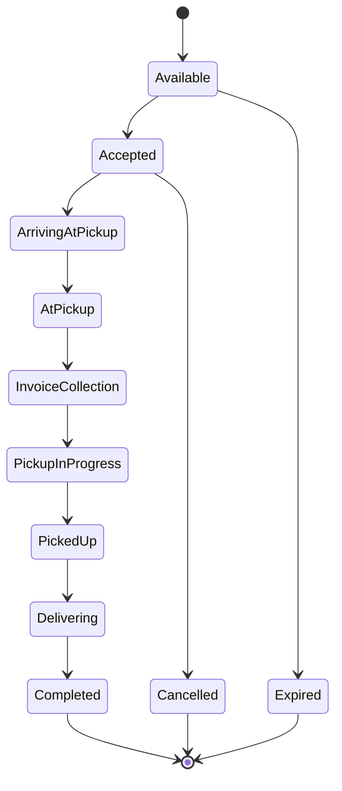

## Trip State Design Goals

| Goal | Description |
|---|---|
| Driver clarity | Driver always knows next required action |
| Multi-order handling | Trip can represent multiple orders |
| Operational control | Admin can monitor trip progression |
| Payment coordination | Trip waits when customer payment action is needed |
| Completion tracking | Completed trips can support earnings and analytics |
| Exception handling | Cancelled or expired trips can be supported |

---

## Relationship Between Trip and Order States

A trip and its orders are connected but not identical.

For example:

- A trip may be accepted.
- Some orders in the trip may be waiting for invoice submission.
- Some orders may require payment.
- The trip may not continue until required conditions are satisfied.

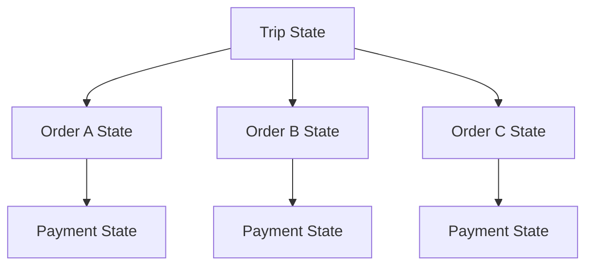

The exact synchronization logic is private.

---

# Customer Workflow Design

The customer workflow is optimized for simplicity.

---

## Customer Workflow

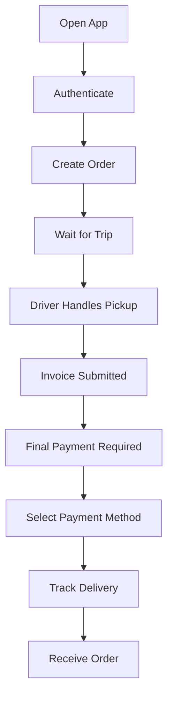

## Customer Workflow Requirements

| Requirement | Description |
|---|---|
| Fast login | Phone OTP should be simple |
| Simple order creation | Customer should not fill unnecessary fields |
| Clear waiting state | Customer understands order is being processed |
| Final amount clarity | Customer sees final amount before payment selection |
| Delivery progress | Customer sees meaningful updates |
| Completion confirmation | Customer knows when order is delivered |

---

# Driver Workflow Design

The driver workflow is action-oriented.

---

## Driver Workflow

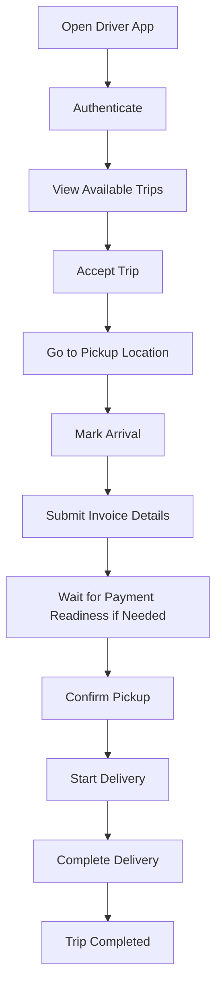

## Driver Workflow Requirements

| Requirement | Description |
|---|---|
| Clear available trips | Driver sees trips worth accepting |
| Clear trip contents | Driver understands included orders |
| Guided action flow | Driver sees the next required action |
| Fast invoice entry | Driver can quickly submit invoice amount |
| Optional evidence | Driver can optionally attach invoice image |
| Controlled progression | Driver cannot skip required workflow stages |
| Completion clarity | Driver knows when the trip is done |

---

# Admin Workflow Design

The admin workflow is monitoring-oriented.

---

## Admin Workflow

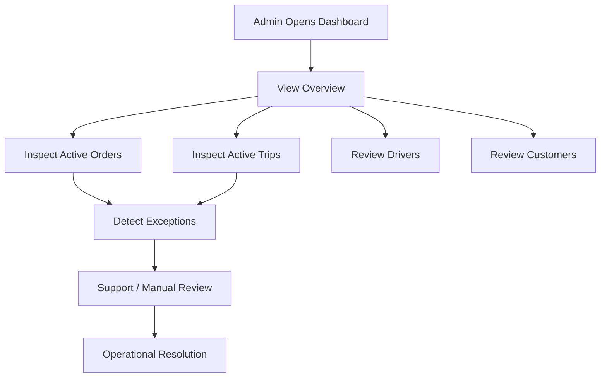

## Admin Workflow Requirements

| Requirement | Description |
|---|---|
| Order visibility | Admin can see order lifecycle status |
| Trip visibility | Admin can see active trip status |
| Driver visibility | Admin can understand driver participation |
| Exception detection | Admin can find stuck or delayed states |
| Support context | Admin can help customers and drivers |
| Analytics foundation | Admin data can later support dashboards |

---

# Trip-Pooling Design Concept

Trip pooling is the central business concept of Jeerah.

---

## Public Concept

Traditional model:

```text
Customer A → Driver A
Customer B → Driver B
Customer C → Driver C
```

Jeerah model:

```text
Customer A
Customer B  → Shared Trip → One Driver
Customer C
```

---

## Trip-Pooling Design Goals

| Goal | Description |
|---|---|
| Improve trip value | Increase the value of a driver journey |
| Lower customer cost | Share delivery economics across compatible orders |
| Improve availability | Encourage drivers to accept trips |
| Reduce wasted distance | Reduce inefficient one-order trips |
| Support remote areas | Make delivery viable where demand is sparse |

---

## Public Trip-Pooling Components

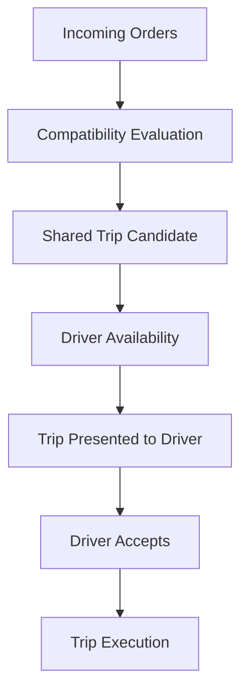

## Private Trip-Pooling Details

The actual implementation is private and not included.

Private details include:

- Compatibility criteria
- Distance thresholds
- Timing rules
- Capacity rules
- Matching logic
- Ranking logic
- Driver assignment rules
- Pricing influence
- Route optimization assumptions
- Edge Function implementation
- Database query strategy

---

# Invoice System Design

The invoice system supports a real-world ordering flow where the final merchant amount may not be known at order creation.

---

## Invoice Workflow

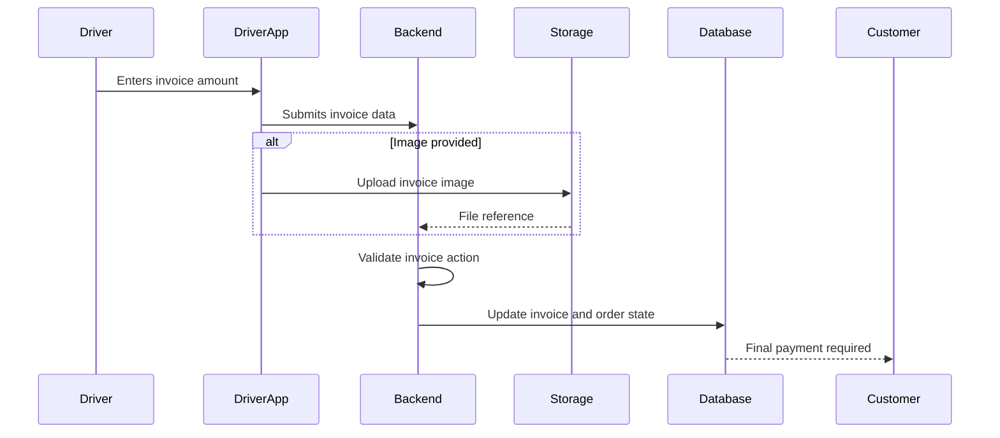

## Invoice System Goals

| Goal | Description |
|---|---|
| Support final amount workflow | Enable customer payment after invoice submission |
| Keep driver flow simple | Amount-only submission should be possible |
| Support optional image | Driver can attach invoice image when useful |
| Maintain order linkage | Invoice must belong to the correct order |
| Enable future admin review | Admin can later inspect invoice-related issues |
| Protect calculations | Final amount logic remains private |

---

# Payment System Design

Payment design in Jeerah is workflow-driven.

The customer may need to select the final payment method after invoice details are available.

---

## Payment Flow

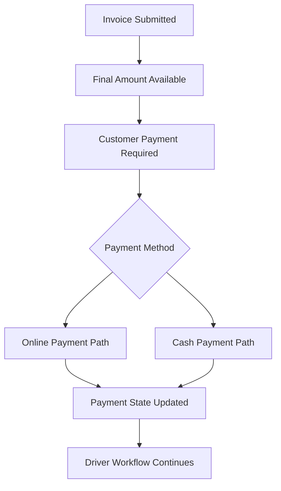

## Payment Design Goals

| Goal | Description |
|---|---|
| Support final amount | Payment happens after final amount is known |
| Support multiple paths | Online and cash payment paths are supported |
| Protect payment logic | Provider and verification logic remain private |
| Coordinate with driver | Driver workflow continues after payment readiness |
| Maintain lifecycle integrity | Payment state must align with order/trip state |

---

## Private Payment Details

Not disclosed:

- Payment provider
- API keys
- Webhook implementation
- Online payment verification
- Refund handling
- Reconciliation
- Pricing calculation
- Delivery fee formula
- Payment edge cases

---

# Realtime Update Design

Realtime updates help keep users informed as the order and trip lifecycle changes.

---

## Realtime Update Model

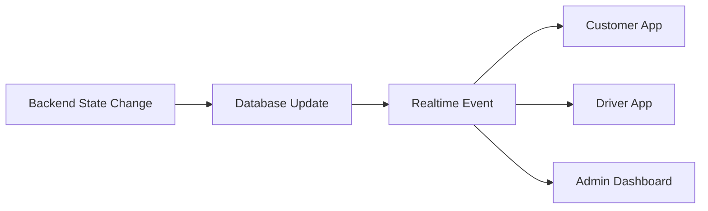

## Realtime Design Goals

| Goal | Description |
|---|---|
| Keep customer informed | Customer sees relevant order status |
| Keep driver informed | Driver sees workflow changes |
| Keep admin informed | Admin sees operational state |
| Reduce refresh needs | Apps update without excessive manual refresh |
| Reflect source of truth | Updates follow database/backend state |

---

## Realtime Design Rule

Realtime updates should reflect trusted backend state.

Clients should not rely on realtime updates as a substitute for backend validation.

---

# Notification Design

Notifications are planned to improve user communication.

---

## Notification Types

| Type | Recipient | Example |
|---|---|---|
| Order Update | Customer | Order status changed |
| Payment Required | Customer | Final payment selection needed |
| Trip Accepted | Customer | Driver accepted shared trip |
| Pickup Update | Customer | Driver picked up order |
| Delivery Update | Customer | Driver is delivering |
| Trip Action | Driver | New workflow action required |
| Admin Alert | Admin | Order may require attention |

---

## Notification Flow

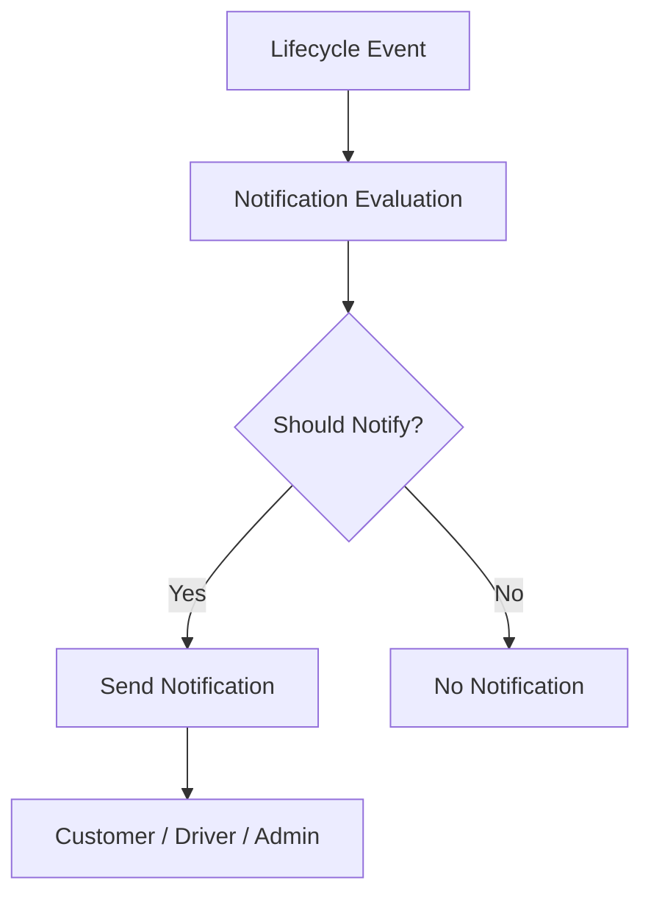

## Notification Design Goals

- Avoid spam
- Notify only on meaningful events
- Support customer trust
- Help drivers act at the right time
- Help admins monitor exceptions
- Support future multi-channel notifications

---

# Security Design

Security is a design requirement, not an afterthought.

---

## Security Model

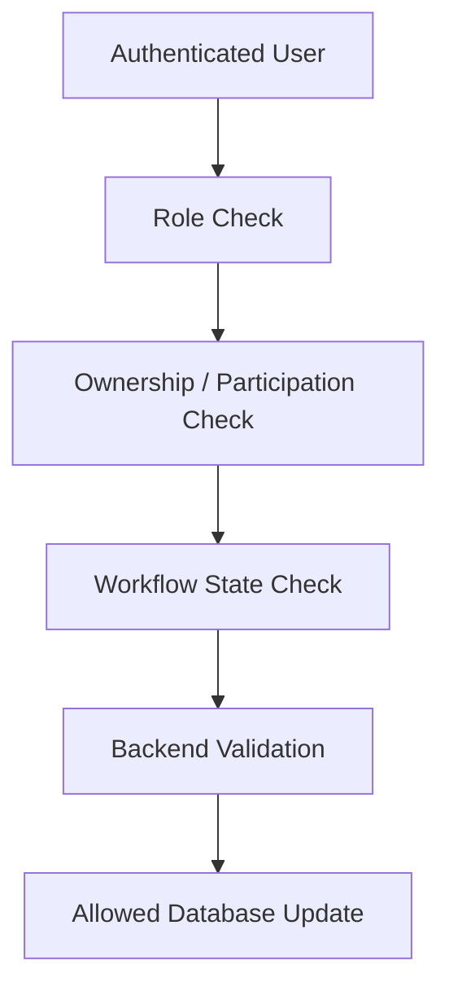

---

## Security Design Principles

| Principle | Description |
|---|---|
| Authenticate every user | Important actions require authenticated identity |
| Separate roles | Customers, drivers, and admins have different access |
| Validate server-side | Sensitive transitions must be validated by backend |
| Minimize data exposure | Users see only what they need |
| Protect secrets | No environment variables in public repository |
| Avoid client trust | Clients do not own critical business logic |
| Keep policies private | RLS and access rules are not published |

---

# Authorization Design

Authorization determines what each actor can do.

---

## Public Authorization Concept

| Actor | Allowed Public Concept |
|---|---|
| Customer | Manage own orders and payment actions |
| Driver | Manage assigned/accepted trip workflow |
| Admin | Monitor and manage operational views |
| Backend | Enforce all critical rules |

---

## Authorization Checks

Important actions may require:

- Authenticated user
- Correct role
- Entity ownership
- Trip participation
- Current state match
- Required data presence
- Backend validation
- No conflicting active operation

The exact authorization implementation is private.

---

# Error Handling Design

A delivery platform must handle failures clearly.

---

## Error Categories

| Category | Example |
|---|---|
| Authentication error | User session expired |
| Validation error | Required field missing |
| State error | Action attempted in wrong lifecycle state |
| Permission error | User tries to access unauthorized data |
| Network error | Client cannot reach backend |
| Payment error | Payment path fails or remains pending |
| Upload error | Invoice image upload fails |
| Operational error | Trip/order requires admin review |

---

## Error Handling Principles

- Show user-friendly messages
- Avoid exposing internal errors
- Preserve lifecycle consistency
- Allow retry where safe
- Prevent duplicate critical actions
- Log operational issues for future review
- Support admin investigation

---

# Data Consistency Design

Data consistency is critical because orders, trips, invoices, and payments are connected.

---

## Consistency Challenges

| Challenge | Risk |
|---|---|
| Driver submits invoice twice | Duplicate final amount updates |
| Customer pays before invoice | Invalid payment state |
| Trip advances before payment | Operational inconsistency |
| Order state changes without trip state | Conflicting UI |
| Network retry duplicates action | Duplicate transitions |
| Admin action conflicts with driver action | Race condition |

---

## Consistency Principles

- Validate current state before updates
- Make critical transitions controlled
- Use backend workflows for sensitive actions
- Keep related entity updates coordinated
- Avoid trusting client-side status
- Design retry-safe operations where possible
- Support future audit logs

---

# Scalability Design

Jeerah is designed to grow from an MVP into a larger commercial platform.

---

## Scaling Dimensions

| Dimension | Scaling Need |
|---|---|
| Customers | More users creating orders |
| Drivers | More active drivers accepting trips |
| Orders | More concurrent order lifecycle records |
| Trips | More active shared trips |
| Regions | More geographic areas |
| Admins | More operational users |
| Notifications | More event-based updates |
| Analytics | More reporting data |

---

## Scalability Design Approach

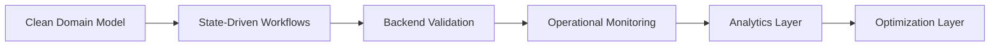

## Scalability Principles

- Keep core workflows modular
- Avoid hardcoding region-specific behavior
- Support future indexing and query optimization
- Prepare for analytics views
- Separate operational reads from sensitive writes
- Keep heavy logic out of mobile clients
- Support future background processing

---

# Reliability Design

Reliability means the system behaves predictably under normal and abnormal conditions.

---

## Reliability Requirements

| Requirement | Why It Matters |
|---|---|
| Predictable state transitions | Prevent inconsistent workflows |
| Idempotent critical actions | Avoid duplicates during retries |
| Clear error states | Help users recover |
| Admin visibility | Allow manual support |
| Persistent records | Avoid losing operational history |
| Secure validation | Prevent invalid progression |
| Controlled payment flow | Avoid financial mismatch |

---

## Reliability Strategy

- Use lifecycle states as the source of truth
- Validate every major workflow action
- Keep sensitive operations backend-controlled
- Design for network interruptions
- Provide clear UI feedback
- Add future logging and monitoring
- Add admin review tools for edge cases

---

# Observability Design

Observability helps the team understand what is happening inside the system.

---

## Future Observability Signals

| Signal | Purpose |
|---|---|
| Order state duration | Detect slow lifecycle stages |
| Trip completion rate | Understand driver workflow success |
| Payment delay | Detect payment friction |
| Invoice submission errors | Improve driver workflow |
| Failed actions | Detect bugs or misuse |
| Admin interventions | Understand support workload |
| Regional demand | Guide expansion strategy |

---

## Observability Goals

- Improve operations
- Detect workflow bottlenecks
- Support customer service
- Support driver performance analysis
- Support product decisions
- Improve platform reliability

---

# Performance Considerations

Performance matters for mobile users, drivers in the field, and admin operators.

---

## Performance Areas

| Area | Consideration |
|---|---|
| Mobile loading | Keep screens responsive |
| Order creation | Reduce wait time after submission |
| Status updates | Keep lifecycle updates quick |
| Driver actions | Avoid delays during delivery workflow |
| Admin queries | Support filtering and monitoring |
| Image upload | Handle optional invoice images efficiently |
| Realtime events | Avoid unnecessary update noise |

---

## Performance Principles

- Load only required data for each role
- Avoid exposing large datasets to mobile clients
- Use state-specific queries
- Prepare indexing as data grows
- Keep heavy logic server-side
- Optimize admin views separately from mobile views
- Cache or paginate where appropriate in future versions

---

# Admin Operations Design

Admin operations are essential for running Jeerah as a real delivery business.

---

## Admin Operations Areas

| Area | Purpose |
|---|---|
| Order Monitoring | Track current order states |
| Trip Monitoring | Track driver trip progress |
| Driver Review | Understand driver activity |
| Customer Support | Assist customers with active orders |
| Payment Review | Inspect high-level payment status |
| Invoice Review | Future review of invoice submissions |
| Exception Handling | Detect stuck or failed workflows |
| Analytics | Understand business performance |

---

## Admin Operations Flow

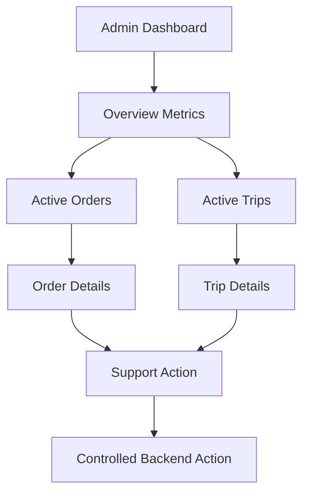

---

# Public Design Diagrams

This section summarizes the public diagrams suitable for a showcase repository.

---

## System Context

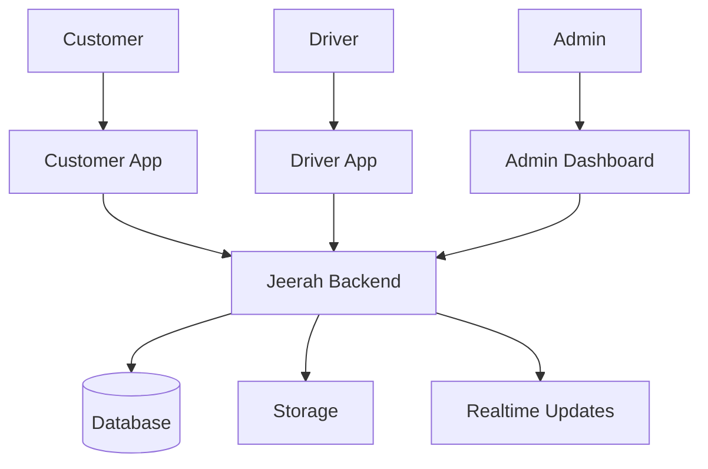

---

## Main Workflow

```mermaid
flowchart TD
    A["Customer Creates Order"] --> B["Order Waits for Trip"]
    B --> C["Trip Is Formed / Available"]
    C --> D["Driver Accepts Trip"]
    D --> E["Driver Arrives at Store"]
    E --> F["Driver Submits Invoice"]
    F --> G["Customer Selects Payment"]
    G --> H["Driver Picks Up Order"]
    H --> I["Driver Delivers Order"]
    I --> J["Order Completed"]
```

---

## Role Separation

```mermaid
flowchart LR
    C["Customer"] --> CO["Own Orders"]
    D["Driver"] --> DT["Assigned Trips"]
    A["Admin"] --> OP["Operational Views"]
    B["Backend"] --> RULES["Validation / Rules"]

    CO --> RULES
    DT --> RULES
    OP --> RULES
```

---

# Sensitive Design Areas

The following areas are intentionally excluded from this public system design:

## Core Commercial Logic

- Trip-pooling algorithm
- Matching criteria
- Delivery fee formula
- Driver earnings model
- Pricing strategy
- Capacity rules
- Distance evaluation
- Timing evaluation

## Security-Sensitive Logic

- RLS policies
- Authorization rules
- Admin permissions
- Storage access rules
- Authentication configuration
- Environment variables
- Secret handling

## Financial Logic

- Payment provider integration
- Payment verification
- Refund handling
- Reconciliation
- Transaction processing
- Webhook handling

## Production Implementation

- Source code
- Database migrations
- Edge Functions
- Supabase project config
- Deployment scripts
- CI/CD configuration
- Production logs

---

# Future Design Improvements

Future improvements may include the following.

---

## Workflow Improvements

- More detailed exception states
- Admin-assisted recovery workflows
- Stronger idempotency handling
- Automated stuck-order detection
- Better cancellation flows
- Refund and dispute flows

---

## Driver Improvements

- Driver earnings dashboard
- Driver wallet
- Trip history
- Availability scheduling
- Improved route guidance
- Driver performance analytics

---

## Customer Improvements

- Saved addresses
- Better order history
- Live tracking
- In-app support
- Ratings
- Promotions
- Referral system

---

## Backend Improvements

- Background job processing
- Event-driven architecture
- Advanced notification service
- Audit logging
- Monitoring dashboards
- Automated alerts
- Rate limiting
- Better failure recovery

---

## Admin Improvements

- Role-based admin accounts
- Support ticket integration
- Manual override workflows
- Advanced analytics
- Regional dashboards
- Payment reconciliation dashboard
- Driver compliance review

---

## Analytics Improvements

- Order funnel analytics
- Trip efficiency analytics
- Driver profitability analytics
- Customer retention analytics
- Regional demand heatmaps
- Payment behavior insights
- Delivery delay analysis

---

# Summary

Jeerah's system design is built around a clear idea:

> Delivery in remote communities requires a different system than delivery in dense cities.

Instead of treating each delivery as an isolated task, Jeerah is designed around shared trips, structured state machines, backend-controlled workflows, and role-specific applications.

The public system design highlights:

- Customer app design
- Driver app design
- Admin dashboard design
- Backend validation
- State-driven order lifecycle
- State-driven trip lifecycle
- Invoice workflow
- Payment workflow
- Realtime updates
- Security boundaries
- Scalability considerations
- Reliability considerations
- Operational monitoring

The private implementation remains protected because Jeerah is a commercial product.

---

## Related Documents

- [`README.md`](README.md)
- [`FEATURES.md`](FEATURES.md)
- [`ARCHITECTURE.md`](ARCHITECTURE.md)
- [`ROADMAP.md`](ROADMAP.md)
- [`SECURITY.md`](SECURITY.md)
- [`NOTICE.md`](NOTICE.md)
- [`LICENSE.md`](LICENSE.md)

---

<div align="center">

**Jeerah System Design**

*A state-driven delivery system designed for smart trip pooling in remote communities.*

</div>
