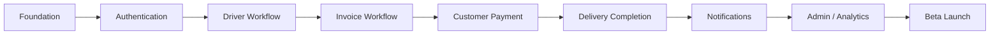

# Jeerah Development Progress

> Public development progress tracker for Jeerah.

---

## Overview

This document tracks public-safe progress for the Jeerah project.

It does not include private implementation details, internal branches, source code, database schema, or proprietary business rules.

---

## Completed

### Product Foundation

- Problem definition
- Shared-trip concept
- Customer app scope
- Driver app scope
- Admin dashboard scope
- MVP direction

### Technical Foundation

- Flutter foundation
- Supabase foundation
- PostgreSQL foundation
- Git workflow foundation
- Public/private repository separation

### Authentication

- Phone OTP login
- OTP verification
- Session foundation
- Role-aware access foundation

### Driver Workflow

- Available shared trips
- Trip acceptance
- Active trip workflow
- Merchant/store arrival
- Multi-order trip foundation

### Invoice Workflow

- Per-order invoice submission
- Amount-only invoice submission
- Optional invoice image support
- Final customer amount workflow trigger

### Customer Payment Workflow

- Final payment selection
- Online payment path foundation
- Cash payment path foundation
- Payment state progression
- Driver workflow continuation after payment

### Public Documentation

- README
- Features
- Architecture
- System Design
- Roadmap
- Security
- FAQ
- Changelog
- Notice
- License

---

## In Progress

- Delivery completion workflow
- Final trip closing
- Admin visibility improvements
- Workflow QA
- Public showcase completion

---

## Planned

- Notifications
- Admin analytics
- Driver earnings dashboard
- Customer support tools
- Production hardening
- Beta launch preparation
- Monitoring and logging
- Security review

---

## Current Priority

The current major product priority is completing the full delivery lifecycle from pickup to final delivery confirmation.

---

## Public Status Summary

---

## Private Progress Areas

The following are not publicly tracked in detail:

- Internal commits
- Private branch names
- Database migrations
- Edge Functions
- Pricing logic
- Trip-pooling algorithm
- Payment provider implementation
- Production credentials
- Internal QA data

---

**Jeerah Development Progress**

*Public status. Private implementation.*

