# Jeerah Screenshots

> Public product screenshots for Jeerah.  
> All screenshots use demo data only and do not expose real customer, driver, payment, address, or production information.

---

## Customer App

The customer app is designed to provide a simple ordering experience for users in remote communities.

<table>
  <tr>
    <td align="center">
      
       
      <b>Welcome Screen</b>
    </td>
    <td align="center">
      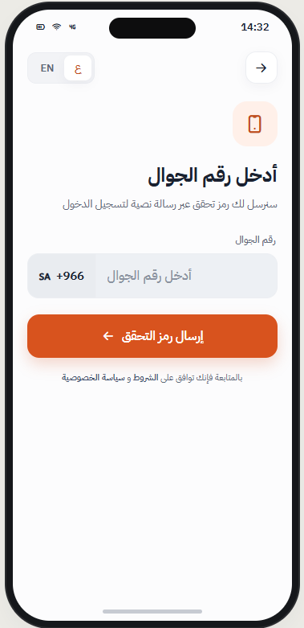
       
      <b>Login</b>
    </td>
    <td align="center">
      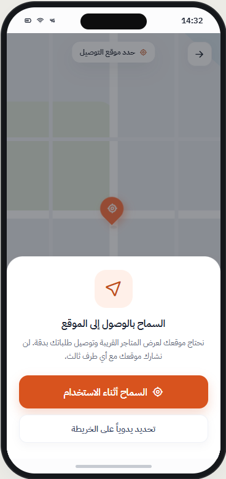
       
      <b>Location Selection</b>
    </td>
  </tr>
  <tr>
    <td align="center">
      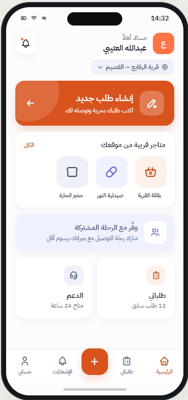
       
      <b>Customer Home</b>
    </td>
    <td align="center">
      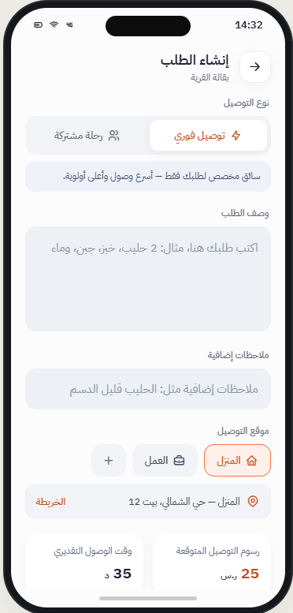
       
      <b>Create Order</b>
    </td>
    <td align="center">
      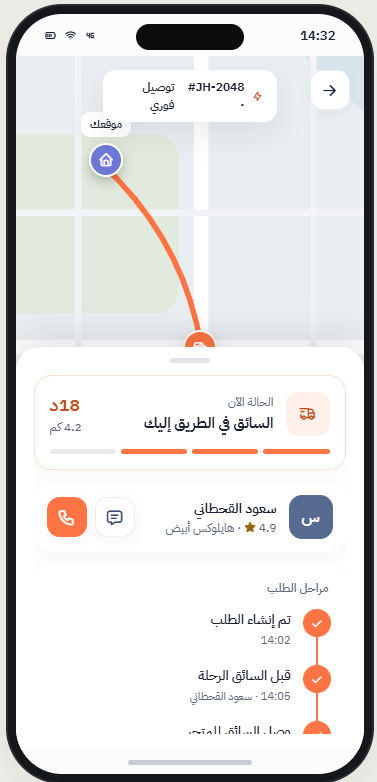
       
      <b>Order Created</b>
    </td>
  </tr>
  <tr>
    <td align="center">
      
       
      <b>Payment</b>
    </td>
    <td align="center">
      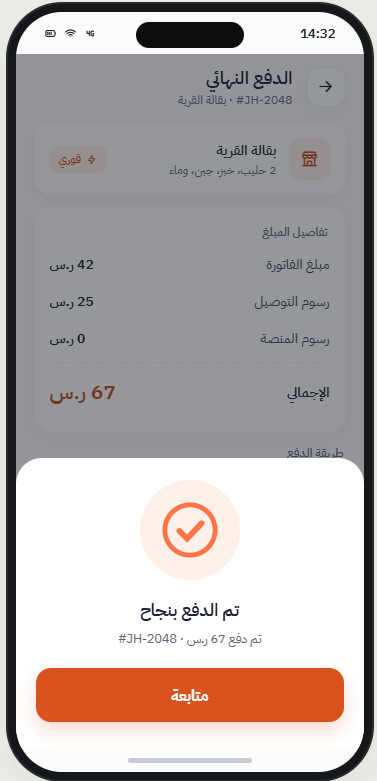
       
      <b>Payment Confirmation</b>
    </td>
    <td align="center">
      
       
      <b>Rating</b>
    </td>
  </tr>
</table>

---

## Driver App

The driver app is designed to help drivers accept shared trips, manage pickup workflows, submit invoices, and complete deliveries.

<table>
  <tr>
    <td align="center">
      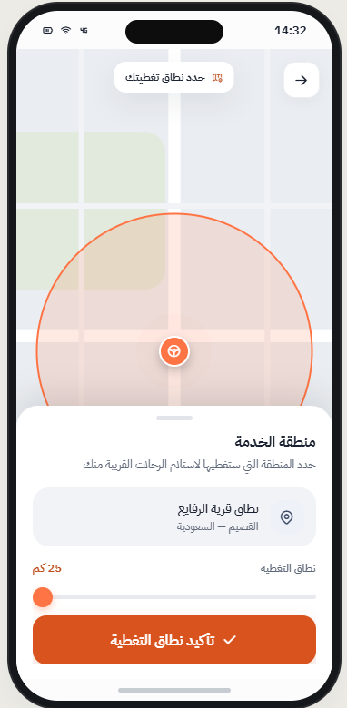
       
      <b>Driver Registration</b>
    </td>
    <td align="center">
      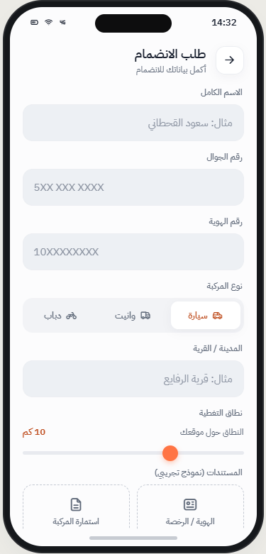
       
      <b>Registration Step 2</b>
    </td>
    <td align="center">
      
       
      <b>Registration Step 3</b>
    </td>
  </tr>
  <tr>
    <td align="center">
      
       
      <b>Registration Step 4</b>
    </td>
    <td align="center">
      
       
      <b>Driver Home</b>
    </td>
    <td align="center">
      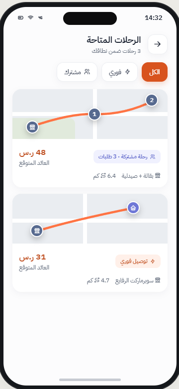
       
      <b>Available Trips</b>
    </td>
  </tr>
  <tr>
    <td align="center">
      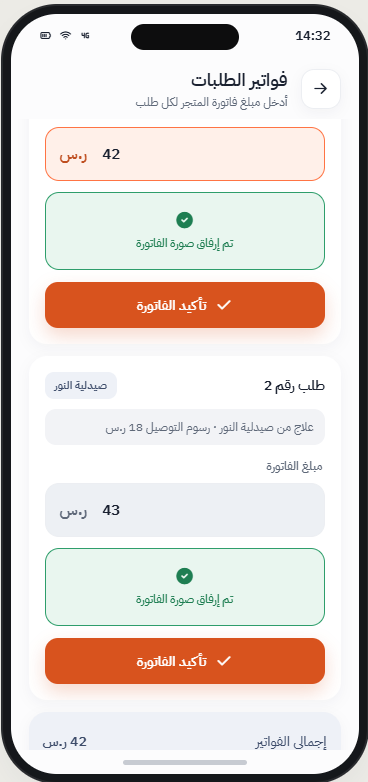
       
      <b>Active Trip</b>
    </td>
    <td align="center">
      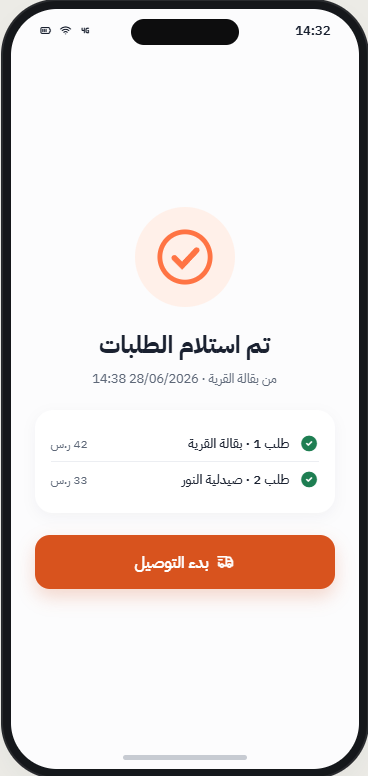
       
      <b>Shared Order</b>
    </td>
    <td align="center">
      
       
      <b>Shared Order Step 2</b>
    </td>
  </tr>
  <tr>
    <td align="center">
      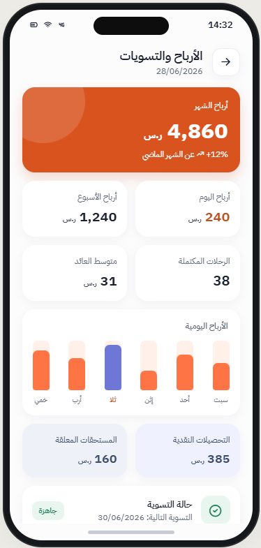
       
      <b>Driver Earnings</b>
    </td>
  </tr>
</table>

---

## Screenshot Safety Notice

All screenshots shown in this repository are intended for public portfolio presentation only.

The screenshots should not include:

- Real customer names
- Real customer phone numbers
- Real driver information
- Real addresses
- Payment credentials
- Production URLs
- Internal IDs
- API responses
- Supabase project details
- Any private or sensitive operational data