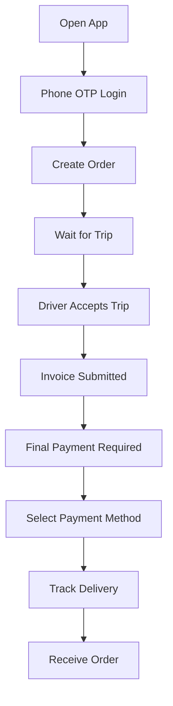
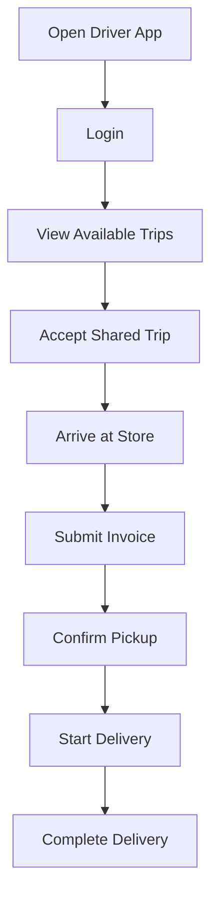
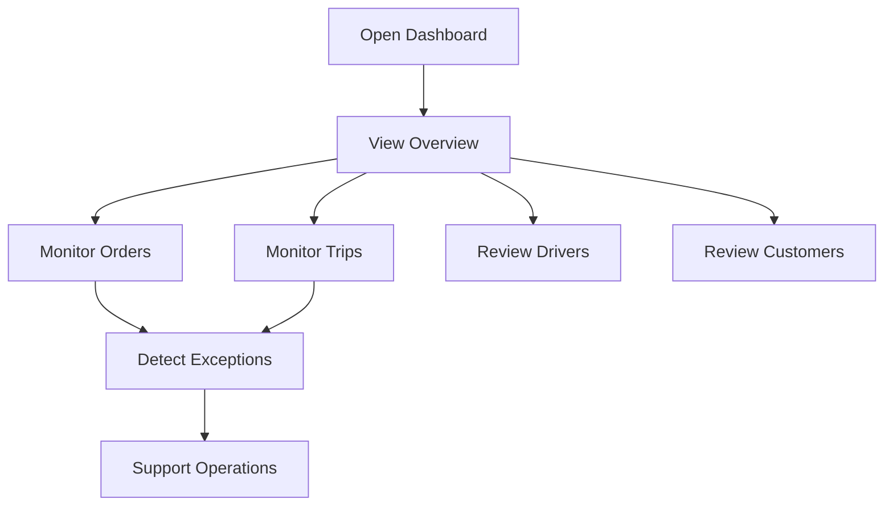
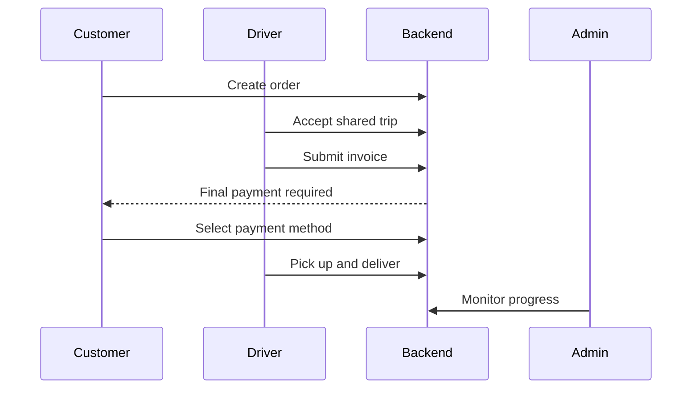

# Jeerah User Flows

> Public user flow documentation for Jeerah.

---

## Overview

Jeerah includes three major user flow categories:

- Customer flows
- Driver flows
- Admin flows

These flows are simplified for public documentation and do not reveal internal validation rules or private business logic.

---

## Customer Flow

---

## Driver Flow

---

## Admin Flow

---

## Cross-Role Flow

---

## Notes

These flows are simplified and public-safe.

Private details not included:

- Exact state names
- Database logic
- Pricing rules
- Payment implementation
- Trip-pooling rules
- Admin permission model

---

**Jeerah User Flows**

*Simple public flows for a private commercial product.*

